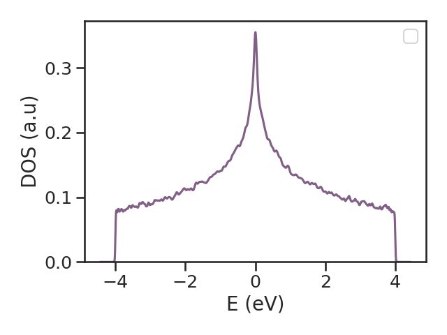

The [`#!python kite.Calculation`][calculation] object contains the information required to calculate desired quantities, i.e. the *target functions*.
Key parameters of the calculation are included here, such as the Chebyshev expansion order and number of disorder realizations.
These are used by [KITEx] to calculate the spectral coefficients. Subsequently, 
at the post-processing stage, [KITE-tools][kitetools] can be used, e.g. to reconstruct the full energy dependence of the desired target function (see [Workflow][Workflow]).
The parameters given in the [Examples] are optimized for relatively small systems and are therefore ideal to run KITE with a standard desktop computer or laptop.

The target functions currently available are:

* [`#!python dos`][calculation-dos]
  : Calculates the average density of states (DOS) as a function of energy.
* [`#!python ldos`][calculation-ldos]
  : Calculates the local density of states (LDOS) as a function of energy (for a set of lattice positions).
* [`#!python arpes`][calculation-arpes]
  : Calculates the one-particle spectral function of relevance to ARPES.
* [`#!python ldos_map`][calculation-ldos_map]
  : Calculates a full real-space map of the LDOS at one target energy.
* [`#!python spectral_map`][calculation-spectral_map]
  : Calculates a full momentum-resolved (k-space) map of the spectral function at one target energy.
* [`#!python gaussian_wave_packet`][calculation-gaussian_wave_packet]
  : Simulates the propagation of a gaussian wave-packet.
* [`#!python localized_wave_packet`][calculation-localized_wave_packet]
  : Simulates the propagation of a localized or gaussian wave-packet with optional spectral filtering.
* [`#!python conductivity_dc`][calculation-conductivity_dc]
  : Calculates a given component of the DC conductivity tensor.
* [`#!python conductivity_optical`][calculation-conductivity_optical]
  : Calculates a given component of the linear optical conductivity tensor.
* [`#!python conductivity_optical_nonlinear`][calculation-conductivity_optical_nonlinear]
  : Calculates a given component of the 2nd-order nonlinear optical conductivity tensor.
* [`#!python singleshot_conductivity_dc`][calculation-singleshot_conductivity_dc]
  : Calculates the longitudinal DC conductivity for a set of Fermi energies (uses the $\propto\mathcal{O}(N)$ single-shot method).
* [`#!python custom_one`][calculation-custom_one], [`#!python custom_one_local`][calculation-custom_one_local], [`#!python custom_two`][calculation-custom_two], [`#!python custom_two_local`][calculation-custom_two_local], [`#!python custom_singleshot_two`][calculation-custom_singleshot_two]
  : Calculate generalized rank-one/rank-two KPM traces of user-defined operators built from `#!python kite.custom.Vertex`.
  

The table below shows to which level the KITE target functions have been implemented and tested at the time of writing (May, 2025). 
Note that the non-linear optical conductivity functionality is currently restricted to 2D systems.
      
| Method                                                                                  | 2D                   | 3D                   |
|:----------------------------------------------------------------------------------------|:---------------------|:---------------------|
| [`#!python dos`][calculation-dos]                                                       | :material-check-all: | :material-check-all: |
| [`#!python ldos`][calculation-ldos]                                                     | :material-check-all: | :material-check:     |
| [`#!python arpes`][calculation-arpes]                                                   | :material-check:     | :material-check:     |
| [`#!python gaussian_wave_packet`][calculation-gaussian_wave_packet]                     | :material-check:     | :material-check:     |
| [`#!python conductivity_dc`][calculation-conductivity_dc]                               | :material-check-all: | :material-check-all: |
| [`#!python conductivity_optical`][calculation-conductivity_optical]                     | :material-check-all: | :material-check:     |
| [`#!python conductivity_optical_nonlinear`][calculation-conductivity_optical_nonlinear] | :material-check:     | :material-close:     |
| [`#!python magnetic_field`][modification-modification-par-magnetic_field]               | :material-check-all: | :material-check:     |
| [`#!python singleshot_conductivity_dc`][calculation-singleshot_conductivity_dc]         | :material-check-all: | :material-check-all: |


  :material-check-all: - Checked and extensively used

  :material-check: - Implemented and checked
  
  :material-close: - Not yet implemented

All target functions require the following parameter:

* `#!python num_moments`
  : Defines the order of Chebyshev expansions and hence the effective energy resolution of the calculation; see [Documentation][optimization].

Other common parameters are:

* `#!python num_random`
  : Defines the number of random vectors used in the stochastic trace evaluation.
* `#!python num_disorder`
  : Defines the number of disorder realizations (and automatically specifies the boundary twist angles if the `#!python "random"` boundary mode is chosen; see [Settings][settings]).

Some functions also require the following parameters:

* `#!python direction`
  : Specifies the component of the linear (longitudinal: (`#!python 'xx'`, `#!python 'yy'`, `#!python 'zz'`), transversal: (`#!python 'xy'`, `#!python 'yx'`, `#!python 'xz'`, `#!python 'yz'`)) or the nonlinear conductivity tensor (e.g., `#!python 'xyx'` or `#!python 'xxz'`) to be calculated.
* `#!python temperature` _(can be modified at post-processing level)_
: Temperature of the Fermi-Dirac distribution used to evaluate optical and DC conductivities.  `#!python temperature` specifies the quantity $k_B T$, which has units of `#!python energy`. For example, if the hoppings are given in eV, `#!python temperature` must be given in eV. 
    
* `#!python num_points` _(can be modified at post-processing level)_
  : Number of energy points used by the post-processing tool to output the `#!python dos` and other target functions.
* `#!python energy`
  : Selected values of Fermi energy at which we want to calculate the `#!python singleshot_conductivity_dc`.
* `#!python eta`
  : Imaginary constant (scalar self energy) in the denominator of the Green's function required for lattice calculations of finite-size systems, i.e. an energy resolution (can also be seen as a controlled broadening or inelastic energy scale). For technical details, see [Documentation][optimization].

The `#!python calculation` is structured in the following way:

``` py linenums="1"
calculation = kite.Calculation(configuration)
calculation.dos(
    num_points=1000,
    num_random=10,
    num_disorder=1,
    num_moments=512
)
calculation.conductivity_optical(
    num_points=1000,
    num_random=1,
    num_disorder=1,
    num_moments=512,
    direction='xx'
)
calculation.conductivity_dc(
    num_points=1000,
    num_moments=256,
    num_random=1,
    num_disorder=1,
    direction='xy',
    temperature=1
)
calculation.singleshot_conductivity_dc(
    energy=[(n / 100.0 - 0.5) * 2 for n in range(101)],
    num_moments=256,
    num_random=1,
    num_disorder=1,
    direction='xx',
    eta=0.02
)
calculation.conductivity_optical_nonlinear(
    num_points=1000,
    num_moments=256,
    num_random=1,
    num_disorder=1,
    direction='xxx',
    temperature=1.0,
    special=1
)
```

!!! note

    The user can decide what functions are used in a calculation.
    However, it is not possible to configure the same function twice in the same configuration file.

## Additional target functions

The functions below are also implemented but are not part of the compact example above; each has a
full parameter reference (and any important caveats) linked from its name.

### Real-space and momentum-space energy maps

[`#!python ldos_map`][calculation-ldos_map] calculates a full real-space map of the local density of states at
one target energy, using a stochastic (random-phase-vector) Chebyshev estimator — unlike
[`#!python ldos`][calculation-ldos], which gives the energy dependence at a fixed position.
[`#!python spectral_map`][calculation-spectral_map] is its momentum-resolved counterpart: an "all-k-at-once"
stochastic sibling of [`#!python arpes`][calculation-arpes] that wraps the same filtering machinery in a
real-space↔k-space FFT. Both evaluate a single disorder realization per call (there is no `#!python num_disorder`
averaging), which is by design for visualizing one disorder configuration rather than a disorder-ensemble average.

``` python
calculation.ldos_map(0.0, 0.1, 10)      # energy, sigma, vectors
calculation.spectral_map(0.0, 0.1, 10)  # energy, sigma, vectors
```

See the [full reference][calculation-ldos_map] for parameters and an important caveat about boundary conditions
when using `#!python spectral_map`.

### Localized wave packets

[`#!python localized_wave_packet`][calculation-localized_wave_packet] simulates the propagation of a point-like
or Gaussian-enveloped wave packet, optionally filtered to a chosen energy window before propagation. Unlike
[`#!python gaussian_wave_packet`][calculation-gaussian_wave_packet], it reports spatial spread statistics, return
probability, propagator amplitude, spectral moments, and transmission weights at chosen probe positions — useful
for wave-packet-spreading/transport studies in a disordered channel embedded between clean leads. See the
[full reference][calculation-localized_wave_packet] for the complete parameter list; there is no worked example
script for it yet.

### Custom operators: `custom_one`, `custom_two`, and their local/single-shot variants

KITE also supports generalized KPM traces of user-defined operators, built from a
[`#!python kite.custom.Vertex`][calculation-custom_one] object (`#!python from kite import custom`) using a
compact operator-string grammar (e.g. `#!python "vy.rx"` for a velocity–position operator product). The full
grammar, and how to register custom orbital-space operators with
[`#!python add_orbital_index`][calculation-add_orbital_index]/[`#!python add_orbital_coupling`][calculation-add_orbital_coupling],
is described in the [full reference][calculation-custom_one]. The available functions are:

* [`#!python custom_one`][calculation-custom_one] / [`#!python custom_one_local`][calculation-custom_one_local]
  : The rank-one trace `#!python Tr[Tn(H)·J]` for one operator $J$, either as a lattice-wide trace or resolved at
    one position/energy.
* [`#!python custom_two`][calculation-custom_two] / [`#!python custom_two_local`][calculation-custom_two_local] / [`#!python custom_singleshot_two`][calculation-custom_singleshot_two]
  : The rank-two trace `#!python Tr[Tn(H)·A·Tm(H)·B]` for two operators $A$, $B$ — as an energy-integrated
    (Fermi-sea) quantity, resolved at chosen positions, or evaluated single-shot at chosen energies (KITEx-only,
    no post-processing).

See [Custom Vertex Operators][custom-vertex-example] for a fully worked example (`#!python custom_two`, the
Kane-Mele spin Hall effect).

When these objects are defined, we can set up the I/O instructions for [KITEx][kitex]
using the [`#!python kite.config_system`][config_system] function:  
``` python
kite.config_system(lattice, configuration, calculation, filename='test.h5')
```
Export the KITE model to the I/O HDF file, by running 
``` bash
python3 script_name_here.py
```

### Running a Calculation

To [run the code][kitex] and to [post-process][kitetools] it, run from the `#!bash kite/`-directory

``` bash
./build/KITEx test.h5
./build/KITE-tools test.h5
```

!!! Info "KITE-tools output"

    The [output][kitetools-output] of [KITE-tools][kitetools] is dependent on the target function specified by the user.
    Each specific case is described in the [API][kitetools-output].
    This [output][kitetools-output] is generally a `#!python "*.dat"`-file where the various columns of data contain
    the required target functions.


## Visualizing the Output Data

After calculating and post-processing the target functions, we can plot the resulting data with the following script:

``` py linenums="1"
data=np.loadtxt('dos.dat')

plt.plot(data[:,0], data[:,1])
plt.xlabel('E (eV)')
plt.ylabel('DOS (a.u)')
```
<div>
  <figure>
    
    <figcaption> </figcaption>
  </figure>
</div>

A more streamlined approach would be to use a Bash script, for example:

``` bash linenums="1"
#!/bin/bash

file_out=example1                 # name of python script that exports the HDF5-file
file_in=example1                  # name of the exported HDF5-file

python ${file_out}.py             # make a model
./build/KITEx ${file_in}.h5       # run Kite

./build/KITE-tools ${file_in}.h5  # run the post-processing steps
python plot_dos.py                # display the data
```


[HDF5]: https://www.hdfgroup.org
[pybinding]: https://docs.pybinding.site/en/stable
[lattice]: https://docs.pybinding.site/en/stable/_api/pybinding.Lattice.html
[documentation]: ../background/index.md
[tightbinding]: ../background/tight_binding.md
[workflow]: ../documentation/workflow.md
[optimization]: ../documentation/optimization.md   

[lattice-tutorial]: tb_model.md
[tutorial-hdf5]: editing_hdf_files.md

[kitepython]: ../api/kite.md
[kitex]: ../api/kitex.md
[kitetools]: ../api/kite-tools.md
[kitetools-output]: ../api/kite-tools.md#output

[calculation]: index.md
[DOS]: index.md
[conductivity]: index.md
[modifications]: index.md
[disorder]: index.md
[Examples]: examples/graphene.md
[settings]: settings.md

[configuration]: ../api/kite.md#configuration
[configuration-divisions]: ../api/kite.md#configuration-divisions
[configuration-length]: ../api/kite.md#configuration-length
[configuration-boundaries]: settings.md#boundaries
[configuration-is_complex]: ../api/kite.md#configuration-is_complex
[configuration-precision]: ../api/kite.md#configuration-precision
[configuration-spectrum_range]: ../api/kite.md#configuration-spectrum_range
[configuration-angles]: ../api/kite.md#configuration-angles
[configuration-custom_local]: ../api/kite.md#configuration-custom_local
[configuration-custom_local_print]: ../api/kite.md#configuration-custom_local_print
[calculation]: ../api/kite.md#calculation
[calculation-dos]: ../api/kite.md#calculation-dos
[calculation-ldos]: ../api/kite.md#calculation-ldos
[calculation-ldos_map]: ../api/kite.md#calculation-ldos_map
[calculation-spectral_map]: ../api/kite.md#calculation-spectral_map
[calculation-arpes]: ../api/kite.md#calculation-arpes
[calculation-gaussian_wave_packet]: ../api/kite.md#calculation-gaussian_wave_packet
[calculation-localized_wave_packet]: ../api/kite.md#calculation-localized_wave_packet
[calculation-conductivity_dc]: ../api/kite.md#calculation-conductivity_dc
[calculation-conductivity_optical]: ../api/kite.md#calculation-conductivity_optical
[calculation-conductivity_optical_nonlinear]: ../api/kite.md#calculation-conductivity_optical_nonlinear
[calculation-singleshot_conductivity_dc]: ../api/kite.md#calculation-singleshot_conductivity_dc
[calculation-add_orbital_index]: ../api/kite.md#calculation-add_orbital_index
[calculation-add_orbital_coupling]: ../api/kite.md#calculation-add_orbital_coupling
[calculation-custom_one]: ../api/kite.md#calculation-custom_one
[calculation-custom_one_local]: ../api/kite.md#calculation-custom_one_local
[calculation-custom_two]: ../api/kite.md#calculation-custom_two
[calculation-custom_two_local]: ../api/kite.md#calculation-custom_two_local
[calculation-custom_singleshot_two]: ../api/kite.md#calculation-custom_singleshot_two
[custom-vertex-example]: examples/custom_vertex_operators.md

[modification-modification-par-magnetic_field]: ../api/kite.md#modification-par-magnetic_field

[config_system]: ../api/kite.md#config_system
