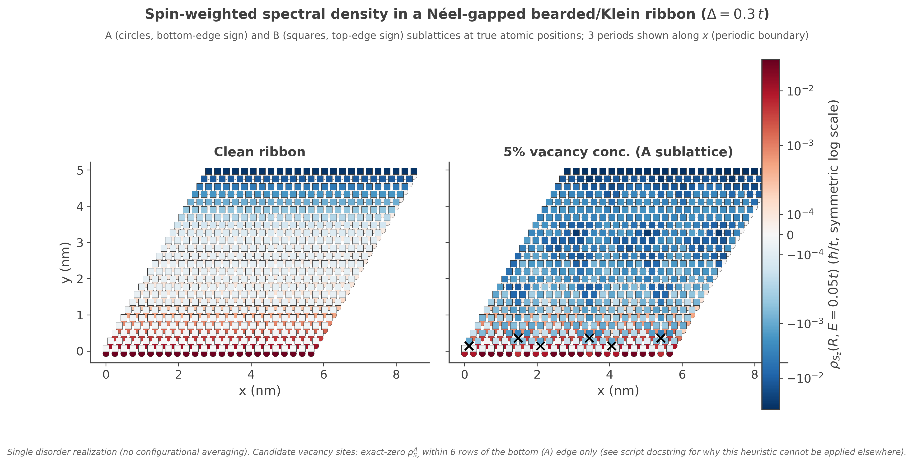
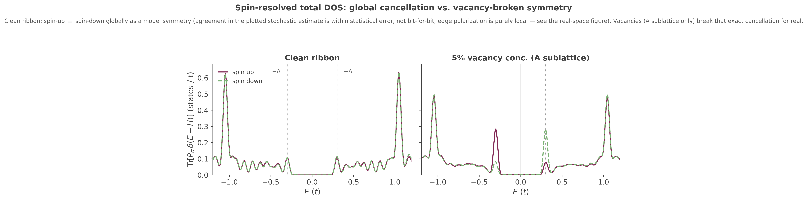

## Néel-gapped bearded/Klein ribbon: operator-weighted LDOS and spin-resolved DOS

A worked example of `#!python ldos_map(operators=[...])` and per-spin `#!python custom_one()`
on a bearded/Klein-terminated graphene ribbon with a fixed (not self-consistently solved)
staggered on-site mass — opposite sign per sublattice, opposite sign per spin. It exercises three
related API features together: operator-weighted local spectral density, structural vacancy
disorder, and spin-resolved total DOS.

### The model

`#!python examples/afm_zigzag_ribbon.py`'s `#!python afm_zigzag_lattice()` builds a 4-sublattice
honeycomb lattice (`Aup, Bup, Adn, Bdn`) with on-site energies $+\Delta$ on `Aup`/`Bdn` and
$-\Delta$ on `Bup`/`Adn` ($\Delta=0.3\,t$ here), periodic along $\mathbf a_1$ and open along
$\mathbf a_2$. The three nearest-neighbor bond offsets this lattice uses — $(0,0)$, $(1,-1)$,
$(0,-1)$ in unit-cell coordinates — put *both* of a bulk A atom's non-intracell bonds toward the
same row ($y-1$), and both of a bulk B atom's toward $y+1$; cutting the open boundary therefore
removes *both* of a boundary A atom's inter-row bonds at once (coordination 1), not one of two as
an ordinary zigzag edge would. This is a **bearded/Klein-type termination**, not an ordinary
zigzag edge, despite an otherwise-honeycomb bulk.

That termination still supports two near-flat edge bands close to $E=\pm\Delta$, each localized on
one sublattice at one edge and (because the mass flips sign between spins) on one spin as well.
These bands sit at $E=\pm\Delta$ *exactly* only at $k=0$ (where the massless edge state is exactly
single-sublattice, so the diagonal mass term acts on it as a scalar) and stay extremely close to
$\Delta$ through most of the zone; they are not protected by chiral symmetry of the *massive*
Hamiltonian itself (the staggered mass commutes, rather than anticommutes, with the sublattice
operator, so this symmetry argument applies to the massless limit, not the full Hamiltonian) — see
the script's own docstring for the full, numerically-checked derivation.

### Mapping the local spectral density: `ldos_map(operators=[...])`

`#!python ldos_map()` normally computes a single, plain quantity: the local density of states at
every site, at one target energy, via a stochastic (random-vector) KPM estimate. Its
`#!python operators=` parameter generalizes this to $\rho_O(r,E)=-\tfrac1\pi\text{Im}\,
\text{Tr}[O\cdot G(r,r,E)]$ — the same map, but weighted at every site by a Hermitian on-site
operator $O$ instead of the identity, so instead of "how many states" you get "what expectation
value of $O$ do the states at this site/energy carry." Passing `#!python operators=None` (the
default) reproduces the plain LDOS map unchanged.

Two different costs are worth keeping separate here. Requesting **multiple operator labels**
together (as `l0` and `l1` are here) is cheap: internally, all requested labels are evaluated from
the *same* random-vector propagation, so adding a second or third label doesn't add another
stochastic run. Requesting operators **at all**, however, is not free relative to a plain LDOS map:
KITEx dispatches the operator-weighted map as its own separate calculation
(`calc_ldos_operators()`, distinct from plain `#!python ldos_map()`'s `calc_ldos()`), with its own
random-vector propagation and its own disorder realization. If you request both a plain map and an
operator map in the same run, you pay for two independent stochastic calculations, not one shared
one — and their results are not guaranteed to come from matching disorder/random-vector draws
unless you control that yourself (e.g. fixed seeds).

$O$ itself is never passed as a matrix. It's built the same way `#!python custom_one()`/
`#!python custom_two()`/`#!python gaussian_wave_packet()` build *their* operators — two steps:

``` python
def register_sz_operators(calculation):
    # Step 1: give each orbital a name. This just creates a name -> index lookup
    # table on `calculation`; it does not touch the Hamiltonian.
    for lbl, idx in [('Aup', 0), ('Bup', 1), ('Adn', 2), ('Bdn', 3)]:
        calculation.add_orbital_index(lbl, idx)

    # Step 2: add_orbital_coupling(start, last, c, label) sets one matrix entry
    # O[last, start] = c in the operator registered under `label` (note the
    # reversed row/col order relative to the argument order -- invisible for
    # a diagonal entry like these, where start == last, but matters for an
    # off-diagonal operator). Call it once per nonzero entry; unset entries
    # default to zero.
    calculation.add_orbital_coupling('Aup', 'Aup', 0.5, 'l0')   # -> l0 = diag(+0.5, 0, -0.5, 0)
    calculation.add_orbital_coupling('Adn', 'Adn', -0.5, 'l0')  #    = Sz restricted to sublattice A
    calculation.add_orbital_coupling('Bup', 'Bup', 0.5, 'l1')   # -> l1 = diag(0, +0.5, 0, -0.5)
    calculation.add_orbital_coupling('Bdn', 'Bdn', -0.5, 'l1')  #    = Sz restricted to sublattice B
    return ['l0', 'l1']  # hand the label list straight to ldos_map's operators=
```

One combined $S_z=\text{diag}(+\tfrac12,+\tfrac12,-\tfrac12,-\tfrac12)$ (uniform across both
sublattices) would still be a valid registration, but it would sum the two sublattices' opposite
edge polarizations together at every site and hide the checkerboard/edge pattern this example is
about — hence two separate labels, `l0` (A-sublattice-only) and `l1` (B-sublattice-only), each
zero on the sublattice it doesn't cover.

With that registration done, the actual call is the same `#!python ldos_map()` you'd write for a
plain map, plus the label list:

``` python
operators = register_sz_operators(calculation)          # -> ['l0', 'l1']
calculation.ldos_map(energy_=energy, sigma_=sigma, vectors_=vectors, operators=operators)
```

`energy_`/`sigma_`/`vectors_` mean exactly what they mean for a plain `#!python ldos_map()` call
(target energy, Gaussian broadening width, number of random vectors) — `operators=` doesn't
change any of that, it only adds extra output. After the run, KITEx writes one array per label:
`/Calculation/ldos_map/Map_Operators/l0` and `.../l1` in the output HDF5 file, each one value per
unit cell (reshape to `(ly, lx)` to recover the 2D grid — see `afm_zigzag_ribbon_process.py`).
Comparing a clean run (`vacancy_concentration=0.0`) against a ~5% vacancy run (both spin channels
removed at the same site, via two `#!python add_vacancy()` calls on one shared
`#!python kite.StructuralDisorder` instance) shows how a defect locally disturbs the edge spin
pattern:

<figure>
    
    <figcaption>Sz_A (circles) and Sz_B (squares) at every site, clean (left) vs. 5% vacancy
    concentration (right). Signed, symmetric-log color scale shared across both panels. Note this
    is an energy-resolved, operator-weighted local spectral density at a fixed E, not an
    equilibrium spin density (which would need occupation weighting and integration over
    energy).</figcaption>
</figure>

The default `energy=0.05`, `sigma=0.1` deliberately probes a broadened tail *below* the edge-band
energy $\Delta=0.3$, not the resonance itself: evaluated directly at $E=\Delta$, a single
vacancy-disorder realization's response stops being a small, edge-localized disturbance and
instead grows substantially through the ribbon interior, because part of the Brillouin zone has
additional bands close to $\Delta$ that vacancies scatter into more easily there. The off-resonance
default keeps the clean-vs-vacancy comparison legible as a strictly local effect, at the cost of
weaker overall signal — see `afm_zigzag_ribbon.py`'s docstring for the numerical check behind this
choice.

### Mapping the global spin balance: `custom_one()` with spin projectors

`#!python ldos_map` is a *local* probe (one value per site) — it doesn't by itself tell you
whether the two edges' opposite polarizations cancel when you add up the *whole* ribbon.
`afm_zigzag_dos.py` answers that different question with a different tool:
`#!python calculation.custom_one()` computes $\text{Tr}[A\cdot T_n(\tilde H)]$ — a single number
per Chebyshev moment $n$, summed over the *entire* system, which reconstructs into
$\text{Tr}[A\,\delta(E-H)]$: the **total, energy-resolved density of states weighted by operator
$A$** (no $r$ dependence at all, unlike `ldos_map`).

Here $A$ is deliberately the **projector** onto one spin (weight 1 on that spin's two
sublattices, 0 on the other), not $S_z$: $\text{Tr}[S_z\,\delta(E-H)]$ would only give you
spin-up-minus-spin-down (their *difference*), whereas registering each spin's projector
separately lets you compare spin-up DOS against spin-down DOS *directly*, side by side:

``` python
def register_spin_projector(calculation, spin):
    for lbl, idx in [('Aup', 0), ('Bup', 1), ('Adn', 2), ('Bdn', 3)]:
        calculation.add_orbital_index(lbl, idx)
    if spin == "up":
        calculation.add_orbital_coupling('Aup', 'Aup', 1.0, 'l0')   # -> l0 = diag(1,0,0,0)
        calculation.add_orbital_coupling('Bup', 'Bup', 1.0, 'l0')   #    + diag(0,1,0,0)
    else:                                                            #    = P_up
        calculation.add_orbital_coupling('Adn', 'Adn', 1.0, 'l0')   # -> l0 = P_down instead
        calculation.add_orbital_coupling('Bdn', 'Bdn', 1.0, 'l0')
    return ['l0']
```

Calling it looks like this — `#!python custom.Vertex` packages the registered label (with a
coefficient, here `1.0`) into the "vertex" `#!python custom_one()` expects, and `num_moments`
here plays the same role as it does for `#!python ldos()`/`#!python dos()` (Chebyshev expansion
order, i.e. energy resolution):

``` python
from kite import custom

vertex = custom.Vertex(num_moments, [[1.0, "l0"]])
calculation.custom_one(stream_=vertex, num_random_=num_random, num_disorder_=num_disorder)
```

`#!python calculation.dos()` is also called in the same script, unrelated to the operator — it's
just the ordinary, un-weighted total DOS, kept alongside as a reference curve. Because the Python
exporter's HDF5 writer only ever serializes the *first* registered `#!python custom_one()` vertex
(`calculation._custom_one[0]`, regardless of how many times you call `custom_one()`), spin-up and
spin-down are run as two separate KITEx jobs (two calls to `register_spin_projector`, two output
files), each producing its own `.h5`/`.dat` output — `afm_zigzag_dos_process.py` then loads all
four `.dat` files (clean/vacancy × up/down) and plots them together.

<figure>
    
    <figcaption>Spin-up vs. spin-down total DOS, clean (left) vs. 5% vacancy (right). Clean: the
    two curves agree within stochastic uncertainty — exact model-level cancellation of the
    opposite edge polarizations, not bit-for-bit agreement of the plotted finite-sample estimate.
    Vacancy: they visibly split, by much more than that stochastic residual, most strongly at
    E=&plusmn;&Delta;, the edge-band energy.</figcaption>
</figure>

### Running it

``` bash
# 1. Real-space Sz map: clean vs. 5% vacancy
python afm_zigzag_ribbon.py 0.0   # -> afm_zigzag_ribbon_clean-output.h5
python afm_zigzag_ribbon.py 0.05  # -> afm_zigzag_ribbon_vac5-output.h5
../build/KITEx afm_zigzag_ribbon_clean-output.h5
../build/KITEx afm_zigzag_ribbon_vac5-output.h5
python afm_zigzag_ribbon_process.py afm_zigzag_ribbon_clean-output.h5 afm_zigzag_ribbon_vac5-output.h5

# 2. Spin-resolved total DOS: clean vs. 5% vacancy, up vs. down (4 runs)
python afm_zigzag_dos.py up 0.0
python afm_zigzag_dos.py down 0.0
python afm_zigzag_dos.py up 0.05
python afm_zigzag_dos.py down 0.05
../build/KITEx afm_zigzag_dos_clean_up-output.h5
# ... (repeat KITEx for the other three .h5 files)
../build/KITE-tools afm_zigzag_dos_clean_up-output.h5 --DOS -N dos.dat \
    --CustomOne -E -4 4 1000 -N custom_clean_up.dat
# ... (repeat KITE-tools for the other three, matching custom_<tag>.dat names)
python afm_zigzag_dos_process.py
```

`afm_zigzag_bands.py` is a standalone, plain-numpy exact diagonalization of the same lattice
(bulk and ribbon bands) — no KITEx run needed — useful as a quick independent check of the
gap and edge-band energies before spending time on a full KPM run.

!!! example

    Run [the full script family][afm-ribbon-example] yourself, and try a larger `ly` (more ribbon
    width) or a different `vacancy_concentration` to see how the edge signal and its disorder
    sensitivity scale.

[afm-ribbon-example]: https://github.com/quantum-kite/kite-v2/blob/master/examples/afm_zigzag_ribbon.py
