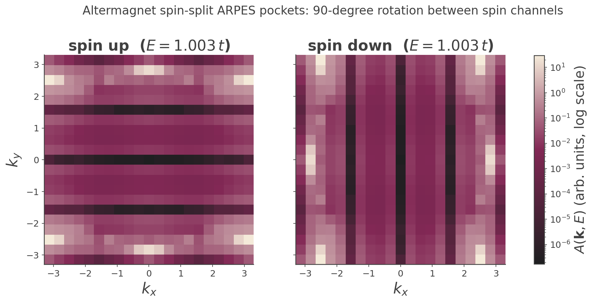

## Altermagnetism: momentum-dependent spin splitting with zero net moment

An **altermagnet** is a collinear magnet that is neither a conventional antiferromagnet nor a ferromagnet: it
has **zero net magnetic moment**, yet it exhibits a **non-relativistic, momentum-dependent spin splitting** of
its bands with a definite (here $d$-wave) parity in $\mathbf k$-space[^1]. This page uses KITE's ARPES
capability to visualize that splitting directly, as a $90^\circ$ rotation between the spin-up and spin-down
constant-energy pockets.

### The model, explicitly

`#!python examples/altermagnet_arpes.py`'s `#!python altermagnet()` builds a square lattice
($\mathbf a_1=[1,0]$, $\mathbf a_2=[0,1]$, $a=1$) with two magnetic sublattices in a checkerboard arrangement —
A at $[0,0]$, B at $[\tfrac12,\tfrac12]$ — made spin-full by four sublattices `Aup, Bup, Adn, Bdn`. The
ingredients:

- **Néel exchange** $J=0.8$ as an on-site energy, alternating sign on A vs B *and* on up vs down:
  $\varepsilon_{A\uparrow}=+J,\ \varepsilon_{B\uparrow}=-J,\ \varepsilon_{A\downarrow}=-J,\ \varepsilon_{B\downarrow}=+J$.
- **Nearest-neighbor** A–B hopping $-t$ ($t=1$) on the four checkerboard bonds, identical for both spins (no
  spin-orbit coupling).
- **Anisotropic next-nearest-neighbor** hopping $\delta=0.4$, spin-independent but **sublattice-swapped**: on
  A, $-\delta$ along $x$ and $+\delta$ along $y$; on B, $+\delta$ along $x$ and $-\delta$ along $y$.

Every hopping is real, and the two spin channels are decoupled, so the $4\times4$ Bloch Hamiltonian is
**block-diagonal**. Writing $c_\mu\equiv\cos k_\mu$, the NN structure factor of the checkerboard bonds is

$$
\gamma(\mathbf k) = -t\big(1+e^{-ik_x}+e^{-ik_y}+e^{-i(k_x+k_y)}\big)= -4t\cos\tfrac{k_x}{2}\cos\tfrac{k_y}{2}\,e^{-i(k_x+k_y)/2},
$$

and the anisotropic NNN diagonal term is

$$
d(\mathbf k) = 2\delta\,(c_y - c_x).
$$

The up-spin block (basis $\{A\!\uparrow, B\!\uparrow\}$) and down-spin block (basis $\{A\!\downarrow, B\!\downarrow\}$) are

$$
H_\uparrow(\mathbf k)=
\begin{pmatrix} +J - d(\mathbf k) & \gamma(\mathbf k)\\[2pt] \gamma^{*}(\mathbf k) & -J + d(\mathbf k)\end{pmatrix},
\qquad
H_\downarrow(\mathbf k)=
\begin{pmatrix} -J - d(\mathbf k) & \gamma(\mathbf k)\\[2pt] \gamma^{*}(\mathbf k) & +J + d(\mathbf k)\end{pmatrix}.
$$

### Dispersion and the spin-splitting identity

Each $2\times2$ block gives

$$
\varepsilon_{\uparrow,\pm}(\mathbf k) = \pm\sqrt{\big(J - d(\mathbf k)\big)^2 + |\gamma(\mathbf k)|^2},\qquad
\varepsilon_{\downarrow,\pm}(\mathbf k) = \pm\sqrt{\big(J + d(\mathbf k)\big)^2 + |\gamma(\mathbf k)|^2}.
$$

Now use two symmetries of the building blocks. $\gamma$ is symmetric under $k_x\leftrightarrow k_y$:
$|\gamma(k_x,k_y)|=|\gamma(k_y,k_x)|$. The anisotropic term is **antisymmetric** under the same swap:

$$
d(k_y,k_x)=2\delta(c_x-c_y)=-d(k_x,k_y).
$$

Therefore

$$
\varepsilon_{\downarrow}(k_x,k_y)=\sqrt{(J+d(k_x,k_y))^2+|\gamma|^2}
=\sqrt{(J-d(k_y,k_x))^2+|\gamma(k_y,k_x)|^2}=\varepsilon_{\uparrow}(k_y,k_x).
$$

$$
\boxed{\ \varepsilon_\uparrow(k_x,k_y)=\varepsilon_\downarrow(k_y,k_x)\ }
$$

The up- and down-spin bands are exact $90^\circ$ rotations of one another. This follows purely from the
**antisymmetry of the sublattice-swapped NNN term under $k_x\leftrightarrow k_y$**, combined with the
opposite-sign Néel field per spin — together they make the substitution $J\to J\mp d$ interchangeable with a
coordinate swap.

### Why this is an altermagnet

**Zero net moment.** From the blocks above, $\mathrm{Tr}\,H_\uparrow=(+J-d)+(-J+d)=0$ and
$\mathrm{Tr}\,H_\downarrow=(-J-d)+(+J+d)=0$ **identically in $\mathbf k$** — the two spin blocks are separately
traceless, so the spin-up and spin-down spectra have the same sum: no net spin polarization when integrated
over the filled bands. This is an exact algebraic statement, not just a numerical observation (though the
example's own `#!python _verify_model()` also confirms it numerically to machine precision on a k-grid).

**Even-parity ($d$-wave) spin splitting.** The splitting is
$\varepsilon_\downarrow(\mathbf k)-\varepsilon_\uparrow(\mathbf k)\propto d(\mathbf k)=2\delta(c_y-c_x)$, which
transforms as $\cos k_y-\cos k_x$ — a $d_{x^2-y^2}$-like, **even** function of $\mathbf k$. Contrast:

- A **conventional antiferromagnet** would need a doubled unit cell / broken translation symmetry to produce
  any spin splitting; with an intact primitive cell its bands are spin-degenerate.
- A **ferromagnet** has a net moment and a spin splitting uniform in sign — not locked to a momentum-space
  symmetry pattern.

The altermagnet threads between: no net moment (like an AFM) but a robust, symmetry-protected,
momentum-dependent splitting (unlike an AFM), of definite even parity (unlike a FM).

### The ARPES walkthrough and result

To *see* the splitting, the example computes the spin-resolved spectral function with a **one-hot orbital
weight** that projects onto a single spin channel:

``` python
weight = [1, 1, 0, 0]   # spin-up: keep only Aup, Bup contributions
weight = [0, 0, 1, 1]   # spin-down: keep only Adn, Bdn
```

Because the ARPES initial state is
$|\mathbf k\rangle=\tfrac{1}{\sqrt N}\sum_{\mathbf r,\alpha}w_\alpha e^{i\mathbf k\cdot(\mathbf r+\mathbf d_\alpha)}|\mathbf r,\alpha\rangle$
(see the [Spectral Function write-up][spectral-function-example]), setting the down-sublattice weights to zero
makes $A(\mathbf k,E)$ measure only the up-spin spectral weight (and vice versa). KITE allows only one
`#!python arpes()` request per output file, so up and down are two separate KITEx runs. A **full 2D
$\mathbf k$-grid** spanning the Brillouin zone $[-\pi,\pi]^2$ is used (rather than a 1D high-symmetry cut)
precisely because the phenomenon is a rotation of the *whole* pocket shape, far more legible as a 2D map than a
line cut.

<figure>
    
    <figcaption>Spin-up (left) and spin-down (right) ARPES intensity maps: an exact 90-degree rotation.</figcaption>
</figure>

**Verified result:** the spin-up and spin-down intensity maps satisfy `#!python grid_up == grid_down.T` to
$\sim10^{-12}$ — an exact $90^\circ$ rotation, the direct visual signature of the identity
$\varepsilon_\uparrow(k_x,k_y)=\varepsilon_\downarrow(k_y,k_x)$ derived above.

### The nodal-line subtlety

The splitting $d(\mathbf k)=2\delta(c_y-c_x)$ vanishes wherever $\cos k_x=\cos k_y$, i.e. on the diagonals
$k_x=k_y$ and $k_x=-k_y$. On these lines the two spin blocks become identical and the bands are exactly
degenerate — genuine **nodal lines of the $d$-wave splitting**, not a numerical artifact, and the direct
algebraic consequence of the even-parity form derived above: any $d_{x^2-y^2}$ function has nodes on the BZ
diagonals.

!!! example

    Get more familiar with KITE: run [the full script][altermagnet_example] yourself, and try varying $\delta$
    (the splitting amplitude) or $J$ (which sets the gap between the two pockets) to see how the rotated
    pockets change shape.

[^1]: L. Šmejkal, J. Sinova, and T. Jungwirth, [Phys. Rev. X **12**, 040501 (2022)](https://doi.org/10.1103/PhysRevX.12.040501).

[spectral-function-example]: spectral_function.md
[altermagnet_example]: https://github.com/quantum-kite/kite-v2/tree/master/examples/altermagnet_arpes.py
