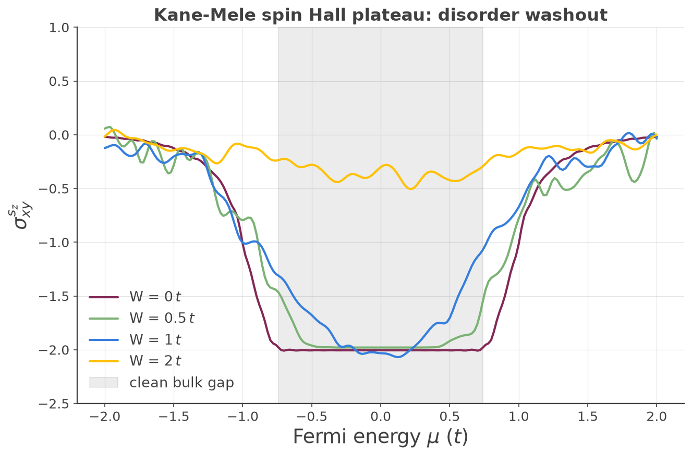

## Custom vertex operators: building arbitrary linear-response functions

KITE's built-in transport methods ([`#!python conductivity_dc`][calculation-conductivity_dc],
[`#!python conductivity_optical`][calculation-conductivity_optical]) compute specific correlators of the
velocity operator. But the underlying Kernel Polynomial machinery is far more general: any two-point response
function built from a **Kubo-Bastin double trace** can be evaluated with the same double-Chebyshev expansion,
provided you can express the two operators entering the correlator. `#!python kite.custom.Vertex` together
with [`#!python custom_two()`][calculation-custom_two] exposes exactly this — letting you assemble arbitrary
operators and compute their Kubo-Bastin correlator directly.

### The general mechanism

A `#!python kite.custom.Vertex` is a **weighted sum of products of elementary operators**, specified as a list
`#!python [[coeff, "opstring"], ...]`. Each `opstring` is a dot-separated product of building blocks — velocity
components (`#!python "vx"`, `#!python "vy"`), position components (`#!python "rx"`, `#!python "ry"`), and
user-defined orbital-space matrices (`#!python "l0"`, ...) registered via
[`#!python add_orbital_coupling()`][calculation-add_orbital_coupling]. Operator strings apply **right-to-left**:
`#!python "vx.l0"` means $\hat v_x\,\hat L$, with $\hat L$ acting first. For example the symmetrized spin
current $\tfrac12\{\hat v_x,\hat s_z\}$ is written

``` python
A = custom.Vertex(num_moments, [[0.5, "vx.l0"], [0.5, "l0.vx"]])
```

which is why both orderings appear. `#!python custom_two()` takes two independently defined vertices $A$ and
$B$ and computes the **double-Chebyshev moment matrix**

$$
\boxed{\ \Gamma_{mn}\;=\;\mathrm{Tr}\!\big[\,T_m(\hat H)\,B\,T_n(\hat H)\,A\,\big]\ }
$$

evaluated stochastically over random vectors and disorder realizations: a random vector seeds one factor;
$A$ is applied to it; $T_n(\hat H)$ is generated by the Chebyshev recursion and $B$ applied to produce the
"right" family; $T_m(\hat H)$ acting on the plain random vector produces the "left" family; the inner product
of the two families gives $\Gamma_{mn}$. **`#!python num_moments` must be even** (enforced by the code).

### From moments to a transport coefficient: the Kubo-Bastin integral

$\Gamma_{mn}$ is a matrix of numbers, not yet a conductivity. The conversion is the numerical implementation of
the **Kubo-Bastin formula**[^1], done in Python (`#!python examples/cond_sum.py`, adapted for spin in
`#!python examples/kane_mele_spin_hall_process.py`). In the KPM representation, both the spectral operator
$\delta(E-\hat H)$ and the Green's-function derivative $dG^{\pm}/dE$ entering the Kubo-Bastin integral are
expanded in Chebyshev polynomials of $\hat H$; substituting these expansions turns the trace into a
contraction of the precomputed moment matrix with two energy-dependent coefficient vectors,

$$
\Gamma(E)=\sum_{m,n}\Delta_m(E)\,\Gamma_{mn}\,\big[dG/dE\big]_n(E),
$$

where $\Delta_m(E)$ reconstructs $\delta(E-\hat H)$ and $[dG/dE]_n(E)$ reconstructs $dG^{+}/dE$. The
Fermi-weighted energy integral $\int dE\, f(E)\,\Gamma(E)$ then gives $\sigma_{AB}(\mu)$ as a function of Fermi
energy, by quadrature. Because $\Gamma_{mn}$ is computed once by KITEx, sweeping temperature, $\mu$, and the
reconstruction broadening is a cheap post-processing step — no re-run of KITEx needed.

### Why this generalizes conductivity

KITE's built-in [`#!python conductivity_dc`][calculation-conductivity_dc] is the same trace with plain velocity
vertices — confirmed directly in `Src/Tools/Gamma2D.cpp`, which builds $\Gamma_{mn}$ by applying
`#!cpp kpm0.Velocity(...)` for one Cartesian direction and `#!cpp kpm1.Velocity(...)` for the other, i.e.
$A=\hat v_x$, $B=\hat v_y$ directly — **no anticommutator**. The bare velocity operator is already the correct,
Hermitian charge-current operator in that direction, so no symmetrization is needed.

The anticommutator *does* appear once you replace one of the velocities with a genuinely different
quantum-number operator (spin, orbital moment): $\tfrac12\{\hat v_x,\hat s_z\}$ is the standard definition of a
**spin current** — the object that represents "spin flowing in the $x$ direction," which is a nontrivial
physical construction distinct from either operator alone, and needs the symmetrized (anticommutator) form to
stay Hermitian in general. Swapping the vertex is still what generalizes the calculation — it's just that
different physical currents are built differently from the elementary operators:

| response | vertex $A$ | vertex $B$ |
|---|---|---|
| charge Hall conductivity (`conductivity_dc`) | $\hat v_x$ | $\hat v_y$ |
| **spin Hall** (this page, via `custom_two`) | $\tfrac12\{\hat v_x,\hat s_z\}$ | $\hat v_y$ |
| orbital Hall | $\tfrac12\{\hat v_x,\hat L_z\}$ | $\hat v_y$ |
| spin/orbital Edelstein | $\hat s_z$ / $\hat L_z$ (bare density) | $\hat v_y$ |

The Kubo-Bastin trace machinery never changes — only the operators you feed it.

### The Kane-Mele spin Hall walkthrough

The Kane-Mele model[^2] is the honeycomb-lattice $\mathbb Z_2$ topological insulator: two **time-reversed
copies of the Haldane model**, one per spin, with the intrinsic (next-nearest-neighbor, complex) spin-orbit
hopping carrying **opposite phase** for the two spins. `#!python examples/kane_mele_spin_hall.py` builds the
lattice with four sublattices — `Aup, Bup, Adn, Bdn` — where the up-spin block reproduces the
[documented Haldane example][haldane-example] exactly (NNN phase $+i$ on A–A) and the down-spin block is its
complex conjugate ($-i$ on A–A). Nearest-neighbor charge hopping is $-t$ and spin-diagonal, with no spin-flip
term. Parameters: $t=1$, $t_2=0.15$, on a $64\times64$ lattice with 256 moments.

The opposite SOC sign per spin is what distinguishes Kane-Mele (a $\mathbb Z_2$ insulator with quantized *spin*
Hall response and zero charge Hall response) from two stacked Haldane copies (a charge Chern insulator).
Intrinsic SOC opens a bulk gap; each Dirac point acquires a mass $3\sqrt3\,t_2$, so the full gap is

$$
E_g = 6\sqrt3\,t_2 = 6\sqrt3\times0.15 \approx 1.56\,t,
$$

a plateau region $|E|\lesssim 3\sqrt3\,t_2\approx 0.78\,t$.

**Building $s_z$.** Because spin is encoded as the sublattice doubling (spin-up and spin-down live on
*separate* sublattices with no hopping between them), the spin operator $\hat s_z=\tfrac12\sigma_z$ is
**diagonal** in the orbital basis, registered as $+\tfrac12$ on the up sublattices and $-\tfrac12$ on the down
sublattices:

``` python
calculation.add_orbital_coupling('Aup', 'Aup',  0.5, 'l0')
calculation.add_orbital_coupling('Bup', 'Bup',  0.5, 'l0')
calculation.add_orbital_coupling('Adn', 'Adn', -0.5, 'l0')
calculation.add_orbital_coupling('Bdn', 'Bdn', -0.5, 'l0')
```

Every sublattice must be registered with [`#!python add_orbital_index()`][calculation-add_orbital_index] — the
orbital operator is a full $N_\text{orb}\times N_\text{orb}$ matrix, and registering only a subset would
silently truncate it. The two vertices are the symmetrized spin current $A=\tfrac12\{\hat v_x,\hat s_z\}$ and
the charge velocity $B=\hat v_y$.

**Verified result.** The Kubo-Bastin post-processing yields a genuinely **flat plateau** at

$$
\sigma^{s_z}_{xy}\approx -2.02
$$

across the bulk gap ($|E|\lesssim 0.74\,t$), consistent with the expected quantized $\mathbb Z_2$ spin Hall
value — the plateau's *existence* and *flatness* are the physics being demonstrated at this lattice size, not
a claim of an exact quantized integer. The overall sign of $\sigma^{s_z}_{xy}$ is fixed by the arbitrary choice
of which spin is assigned $+\tfrac12$ in the `l0` matrix — flipping every `l0` entry flips the sign of the
plateau; this is a genuine convention, not a physical ambiguity.

### The disorder-washout extension

`#!python examples/kane_mele_spin_hall_disorder.py` adds on-site (Anderson) disorder of uniform width $W$ on
all four sublattices and sweeps $W$. Physically, the $\mathbb Z_2$ invariant — and hence the quantized plateau
— is protected as long as (i) the bulk mobility gap survives and (ii) time-reversal symmetry is preserved on
average. On-site potential disorder respects TRS, so for $W$ well below the gap the plateau should be
essentially untouched; once $W$ approaches and exceeds $E_g\approx1.56\,t$, disorder broadening closes the
mobility gap and the plateau degrades.

<figure>
    
    <figcaption>Spin Hall plateau eroding with increasing on-site disorder strength W.</figcaption>
</figure>

**Verified trend:**

| $W/t$ | behavior |
|---|---|
| $0$ | flat plateau $\approx -2.0$ |
| $0.5$ | still flat (well below the gap) |
| $1.0$ | visibly rounding (comparable to the gap) |
| $2.0$ | washed out to $\approx -0.4$ (well past the gap) |

Two implementation points worth flagging. First, the manual `#!python spectrum_range` must bound the *actual*
spectrum including the disorder spread — a fixed clean-model range would let eigenvalues spill outside the
rescaled $[-1,1]$ Chebyshev domain and make $T_m(\hat H)$ diverge exponentially. Second, this is a fast
qualitative demo (`#!python num_disorder_` = 1–3), so the large-$W$ curves are legitimately noisy — small
wiggles there are stochastic, not physical structure.

!!! example

    Get more familiar with KITE: run [`#!python examples/kane_mele_spin_hall.py`][kane_mele_example] and its
    [disorder extension][kane_mele_disorder_example] yourself, and try building a different vertex — spin
    density instead of spin current gives the Edelstein response.

[^1]: J. H. García, L. Covaci, and T. G. Rappoport, [Phys. Rev. Lett. **114**, 116602 (2015)](https://doi.org/10.1103/PhysRevLett.114.116602).
[^2]: C. L. Kane and E. J. Mele, [Phys. Rev. Lett. **95**, 226801 (2005)](https://doi.org/10.1103/PhysRevLett.95.226801).

[calculation-conductivity_dc]: ../../api/kite.md#calculation-conductivity_dc
[calculation-conductivity_optical]: ../../api/kite.md#calculation-conductivity_optical
[calculation-custom_two]: ../../api/kite.md#calculation-custom_two
[calculation-add_orbital_coupling]: ../../api/kite.md#calculation-add_orbital_coupling
[calculation-add_orbital_index]: ../../api/kite.md#calculation-add_orbital_index
[haldane-example]: haldane.md
[kane_mele_example]: https://github.com/quantum-kite/kite-v2/tree/master/examples/kane_mele_spin_hall.py
[kane_mele_disorder_example]: https://github.com/quantum-kite/kite-v2/tree/master/examples/kane_mele_spin_hall_disorder.py
