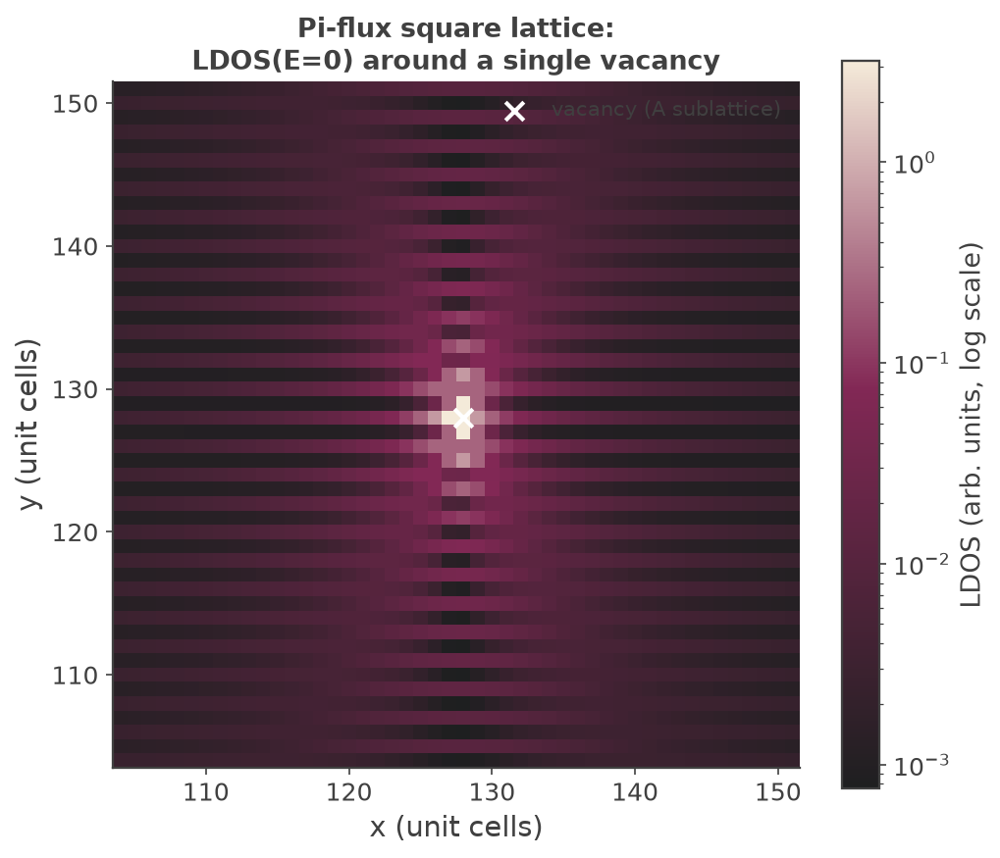
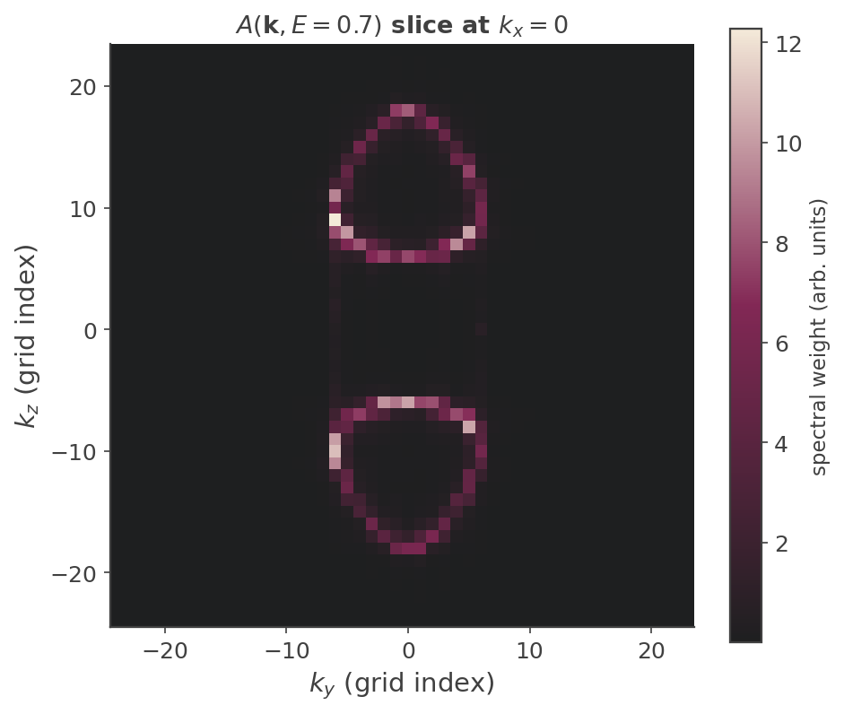

## Real-space and momentum-space maps: a linear-scaling stochastic estimator

Most KITE calculations reduce a physical observable to a **trace** over the whole sample, e.g. the density of
states $\rho(E)=\tfrac1D\,\mathrm{Tr}\,\delta(E-\hat H)$, and evaluate that trace stochastically with a handful
of random vectors. But sometimes the object of interest is not a single number for the whole sample — it is a
**field**: the local density of states $\rho(\mathbf r,E)=\langle \mathbf r|\delta(E-\hat H)|\mathbf r\rangle$
at *every* site, or the spectral function $A(\mathbf k,E)=\langle \mathbf k|\delta(E-\hat H)|\mathbf k\rangle$
at *every* momentum. [`#!python ldos_map()`][calculation-ldos_map] and [`#!python spectral_map()`][calculation-spectral_map]
compute exactly these two fields, over all sites / all momenta **simultaneously**, in a single linear-scaling pass.

### Why the naive approach is expensive, and how a random-vector estimator fixes it

The already-documented single-target calculations — [`#!python ldos()`][calculation-ldos] for one chosen site
and [`#!python arpes()`][calculation-arpes] for one chosen $\mathbf k$-point — each run the full Chebyshev
recursion starting from *one* deterministic seed vector: a single site ket $|\mathbf r_0\rangle$, or a single
Bloch plane wave $|\mathbf k_0\rangle$. Each such run costs $O(N_\text{moments}\times D)$ operations, where $D$
is the number of orbitals in the sample. To obtain the *full map* this way you would repeat the recursion once
per site (or per $\mathbf k$-point) — $D$ independent recursions, for a total cost $O(N_\text{moments}\times D^2)$,
quadratic in system size, and hopeless at the scales KITE targets.

The map estimators avoid the outer loop entirely. They run the recursion from a **single random-phase vector**

$$
|\xi\rangle = \sum_{j} e^{\,i\theta_j}\,|j\rangle,\qquad \theta_j \ \text{i.i.d. uniform on } [0,2\pi),
$$

where $j$ runs over all orbitals of the sample (`Src/Tools/Random.cpp`'s `initA()` generates exactly this
unit-modulus phase for the complex Hamiltonian instantiation; `Src/Vector/KPM_Vector2D.cpp::initiate_vector()`
assigns one such entry per site). The key statistical identity is

$$
\mathbb E\!\left[\,e^{\,i(\theta_{j}-\theta_{j'})}\right]=\delta_{jj'} .
$$

A single recursion carries information about **all** starting sites at once, and each map is filled from one
$O(N_\text{moments}\times D)$ pass — linear scaling. The price is stochastic noise, controlled by the number
of random vectors `#!python vectors_`.

### What the estimator actually returns: $f(H)^2$, not $f(H)$

This is the one point that must be stated carefully, because it drives the normalization. Reading
`Src/Simulation/SimulationLDoS.cpp::ldos()`, the per-site map is built as a Chebyshev reconstruction
$f(\hat H)=\sum_n c_n T_n(\hat H)$ applied to $|\xi\rangle$, then

$$
\text{map}_r = \text{factor}\cdot\big|\langle r|f(\hat H)|\xi\rangle\big|^2 .
$$

Since $|\xi_r|=1$, taking the expectation over the random phases gives

$$
\mathbb E\big[\,|\langle r|f(\hat H)|\xi\rangle|^2\big]
=\sum_{r',r''} f(\hat H)_{r r'}\,f(\hat H)^{*}_{r r''}\,\mathbb E\!\left[e^{i(\theta_{r'}-\theta_{r''})}\right]
=\sum_{r'} |f(\hat H)_{r r'}|^2
=\big[f(\hat H)^2\big]_{rr},
$$

using hermiticity of $f(\hat H)$ in the last step. **The estimator returns the diagonal of $f(\hat H)^2$, not of
$f(\hat H)$.** This is intrinsic to a positive-definite (squared-amplitude) estimator, and it is precisely what
lets the Markov bound apply below — but it means the reconstruction must be chosen so that $f(\hat H)^2$, not
$f(\hat H)$, approximates a delta function.

KITE handles this with a deliberate rescaling. If $\delta_s(x)=e^{-x^2/2s^2}/(s\sqrt{2\pi})$ is a normalized
Gaussian, then $[\delta_s(x)]^2=\tfrac{1}{2s\sqrt\pi}\,\delta_{s/\sqrt2}(x)$ — a normalized Gaussian of width
$s/\sqrt2$ carrying total weight $1/(2s\sqrt\pi)$. So to obtain an LDOS broadened by the *requested* width
$\sigma$, KITE builds $f=\delta_s$ with $s=\sqrt2\,\sigma$ and multiplies by $2s\sqrt\pi=\sqrt{8\pi}\,\sigma$ to
renormalize $f^2$ back to unit weight — exactly the `factor = √(8π)·σ/energy_scale` prefactor used in the code
(the extra $1/\text{energy\_scale}$ converts the delta from the rescaled Chebyshev energy back to physical
units). In summary,

$$
\boxed{\ \mathbb E[\text{map}_r]=\langle r|\,\delta_\sigma(E-\hat H)\,|r\rangle=\rho_\sigma(r,E)\ }
$$

exactly the local density of states, broadened by `#!python sigma_`.

### The Markov-inequality contribution: bounding per-site error without self-averaging

For a **global** quantity such as the total DOS, the stochastic-trace relative error scales as
$1/\sqrt{N_R D}$: the trace averages over all $D$ sites *and* over $N_R$ random vectors, so a larger sample is
itself a larger sample average — the estimator **self-averages**, and the error shrinks as the system grows
even at fixed $N_R$.

A **local** observable has no such luxury. $\rho(r,E)$ at one site is estimated only from the $N_R$
random-vector realizations at that site; enlarging the sample adds *more sites to estimate*, not more samples
of the site you care about. In a disordered or inhomogeneous system the true site-to-site variation of
$\rho(r,E)$ does not diminish with system size — it is physical. So the naive intuition "bigger system
$\Rightarrow$ smaller error" fails for a map: **local observables lack self-averaging.**

This is the problem addressed by Veiga, Pinheiro, Santos Pires &amp; Viana Parente Lopes[^1]. Their observation
is that the map estimator above is **positive-definite** — each sample $\hat X_r\ge 0$ — and a nonnegative
random variable obeys **Markov's inequality**,

$$
\mathbb P\big(\hat X_r \ge a\big)\ \le\ \frac{\mathbb E[\hat X_r]}{a},
$$

which yields a *per-site*, distribution-free confidence bound on the sampling error that holds regardless of
self-averaging — the right tool precisely because the usual $1/\sqrt{N_R D}$ argument is unavailable. (KITE also
reports the empirical per-site stochastic standard error directly: the second row of the output dataset is a
running Welford variance over the `#!python vectors_` realizations.) This page reconstructs the general logic
of why a Markov bound applies here; the paper's precise quantitative bound is not reproduced — consult the
reference directly for the exact constant.

The practical consequence: increasing `#!python vectors_` reduces the per-site noise as $1/\sqrt{\text{vectors\_}}$
(standard Monte-Carlo), with the Markov argument guaranteeing the *relative* error at each site is controlled —
which is why the examples below can shrink from research scale ($2048^2$ lattice, 64 vectors) down to laptop
scale ($256^2$, 32 vectors) and still resolve the physics, just noisier.

### `ldos_map()` — π-flux lattice, LDOS around a single vacancy

`#!python examples/piflux_ldos_map.py` builds a two-sublattice square lattice ($\mathbf a_1=[2,0]$,
$\mathbf a_2=[0,1]$; A at $[0,0]$, B at $[1,0]$) with a **staggered-sign** hopping pattern: uniform $-t$ on the
horizontal A–B bonds, but $+t$ on the B–B and $-t$ on the A–A vertical bonds. Going around one plaquette the
signs multiply to $-1$ — each plaquette is threaded by exactly $\pi$ flux, which folds the square-lattice
spectrum onto a **Dirac cone at $E=0$**, a bipartite-lattice stand-in for graphene-like low-energy physics.

A **single vacancy** is placed on the A sublattice at the sample center via `#!python kite.StructuralDisorder`.
A vacancy at the Dirac point is a physically meaningful test: a missing site acts as a **resonant
(zero-energy) scatterer** in a Dirac system, producing a characteristic LDOS perturbation — suppression at the
defect and slowly decaying, oscillatory (Friedel-like) structure around it — rather than a featureless uniform
map:

``` python
calculation.ldos_map(energy_=0.0, sigma_=1e-2, vectors_=32)
```

<figure>
    
    <figcaption>Real-space LDOS at E=0 around a single vacancy in the pi-flux lattice (log color scale).</figcaption>
</figure>

The verified result: the LDOS is *exactly zero* at the vacancy site itself (there is no A orbital there to
carry weight); the brightest response sits one lattice site off-center, essentially ringing the vacancy; and
the perturbation decays outward with visible oscillatory structure. That oscillation spans roughly two orders
of magnitude between background and peak, so a **linear** color scale collapses everything but the single
brightest pixel — the figure above uses a **log** color scale, which is what makes the decaying ring structure
visible. There is no KITE-tools step for `#!python ldos_map`; the `#!python /Calculation/ldos_map/Map` dataset
(shape `(2, Sizet)`, row 0 the mean, row 1 the stochastic standard error) is read directly with `#!python h5py`.

### `spectral_map()` — Weyl semimetal, constant-energy contours

`#!python examples/weyl_spectral_map.py` builds a two-sublattice cubic lattice with a mass term ($\pm mt$
on-site) and complex nearest-neighbor hoppings realizing a pair of **Weyl nodes** — point-like band touchings
with linear dispersion in all three momentum directions. `#!python spectral_map` computes $A(\mathbf k,E)$ on
the reciprocal grid dual to the supercell, at a **fixed** energy $E=0.7$ deliberately away from the node
energy, so the constant-energy surface is a pair of small spheres around the two nodes rather than two points.
A $(k_y,k_z)$ slice at $k_x=0$ therefore cuts each Weyl sphere in a **closed ring**:

<figure>
    
    <figcaption>Momentum-space spectral function of a Weyl semimetal at E=0.7: two ring contours, the iso-energy
    cut through the two Weyl cones.</figcaption>
</figure>

The verified result is exactly that: two clean closed-ring contours in the $(k_y,k_z)$ plane — the iso-energy
cut through two separated Weyl cones.

**The open-boundary caveat (real physics, not an artifact — mentioned here, not illustrated).** The momentum
resolution is produced by wrapping the Chebyshev recursion between an inverse and a forward FFT — the k-space
sibling of the real-space identity above, with the same $f^2\!\to\!\delta$ renormalization. Crucially, this FFT
runs over **all declared lattice axes**. A momentum label is only physically meaningful along a direction with
translational symmetry; along an **open (hard-wall) boundary** momentum is not conserved, so Fourier-transforming
that axis smears the spectral weight into a flat, featureless distribution instead of sharp peaks. The example
sets `#!python boundaries=["open","random","random"]` on purpose — $x$ open, $y,z$ periodic (twist-averaged) —
so $k_x$ itself is not a meaningful label; that is exactly why the figure above only shows the $(k_y,k_z)$ slice
and never plots anything against $k_x$. At this lattice size the periodic-axis resolution isn't clean enough to
make a convincing side-by-side comparison of sharp-vs-smeared peaks, so no such plot is shown here — the point is
made as a caveat in words: `#!python spectral_map()` gives meaningful $\mathbf k$-resolution only along
periodic/twist-averaged directions.

### Relationship to the single-target calculations

`#!python ldos_map`/`#!python spectral_map` are the "all-at-once" stochastic siblings of the deterministic
single-target routines:

| single target (deterministic seed) | full field (random-phase seed) |
|---|---|
| [`#!python ldos()`][calculation-ldos] — one site $|\mathbf r_0\rangle$ | `#!python ldos_map()` — $\rho(\mathbf r,E)$ at every site |
| [`#!python arpes()`][calculation-arpes] — one Bloch state $|\mathbf k_0\rangle$ | `#!python spectral_map()` — $A(\mathbf k,E)$ at every momentum |

Both map routines are compiled only for the **complex** Hamiltonian instantiation, so
`#!python is_complex=True` is mandatory even for a real-hopping lattice — otherwise the branch is compiled away
and the calculation silently produces no output dataset at all. Both trade the exactness of a single-point
evaluation for linear scaling and per-site stochastic error, with the number of random vectors as the accuracy
knob and the Markov bound as the guarantee that the per-site error is controlled despite the absence of
self-averaging.

!!! example

    Get more familiar with KITE: run [`#!python examples/piflux_ldos_map.py`][piflux_example] and
    [`#!python examples/weyl_spectral_map.py`][weyl_example] yourself, and try varying `#!python vectors_` to
    see the sampling noise shrink.

[^1]: H. P. Veiga, D. R. Pinheiro, J. P. Santos Pires, and J. M. Viana Parente Lopes, "Markov Inequality as a Tool for
    Linear-Scaling Estimation of Local Observables," [Phys. Rev. Research, doi:10.1103/qb1w-44r1](https://journals.aps.org/prresearch/abstract/10.1103/qb1w-44r1),
    [arXiv:2510.21688](https://arxiv.org/abs/2510.21688).

[calculation-ldos]: ../../api/kite.md#calculation-ldos
[calculation-ldos_map]: ../../api/kite.md#calculation-ldos_map
[calculation-arpes]: ../../api/kite.md#calculation-arpes
[calculation-spectral_map]: ../../api/kite.md#calculation-spectral_map
[piflux_example]: https://github.com/quantum-kite/kite-v2/tree/master/examples/piflux_ldos_map.py
[weyl_example]: https://github.com/quantum-kite/kite-v2/tree/master/examples/weyl_spectral_map.py
