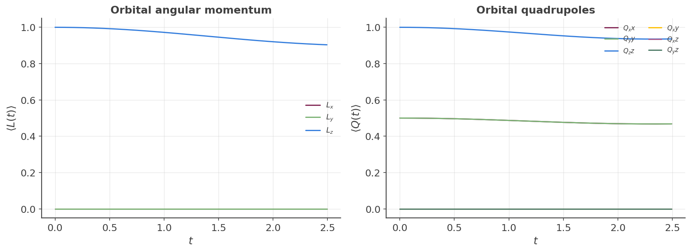

## Orbital angular momentum and quadrupole precession: coupled real-time dynamics

`#!python examples/paper/Section_4_E_spintronics`'s wave-packet examples track real-time spin
precession $\langle S(t)\rangle$ under `#!python calculation.gaussian_wave_packet()`. This page
uses the same real-time Chebyshev propagation of $e^{-iHt}$, but tracks orbital angular momentum
$L$ and orbital quadrupoles $Q_{ab}=\tfrac12\{L_a,L_b\}$ instead — a different physics regime from
the disorder-averaged Kubo-Bastin transport examples elsewhere on this site: this is coherent,
single-particle real-time dynamics, not a DC transport coefficient.

### Tracking an arbitrary operator, not just spin

`#!python gaussian_wave_packet()` has no built-in notion of spin: any operator is tracked through
[`#!python add_orbital_coupling()`][calculation-add_orbital_coupling]'s registration mechanism,
the same one `#!python custom_one()`/`#!python custom_two()` use, passed in as
`#!python operators=[...]`. This has one hard restriction: the operator must be **on-site** — a
single matrix acting on one site's orbitals, applied identically at every site (see the warning
under [`#!python add_orbital_coupling()`][calculation-add_orbital_coupling]). Spin, orbital angular
momentum, and orbital quadrupoles all satisfy this; an operator that couples different lattice
sites cannot be tracked this way.

### The model: an sp³ manifold

$p_x,p_y,p_z$ orbitals at a single site are exactly the $l=1$ angular-momentum representation, so
an sp³ Slater-Koster square lattice (`#!python s, px, py, pz` on-site orbitals, spin-orbit coupling
off) is the natural minimal model — the same lattice used elsewhere for an orbital Hall effect
calculation. $L_x, L_y, L_z$ are built as on-site $4\times4$ matrices (zero on/with the $s$
orbital) via

$$
(L_k)_{jl} = -i\,\epsilon_{kjl}
$$

on the $(p_x,p_y,p_z)$ block — verified Hermitian, satisfying $[L_i,L_j]=i\epsilon_{ijk}L_k$ and
$L^2=2\mathbb 1$ (the standard $l=1$ algebra). The six $Q_{ab}=\tfrac12\{L_a,L_b\}$ follow directly
by matrix multiplication. (This differs by an overall sign from the $L_z$-like operator used in the
orbital Hall example — as with spin, the overall sign of an angular momentum operator is a
convention, not a physical ambiguity.)

### Why L and Q are coupled

$Q_{ab}$'s Heisenberg torque, $\mathcal T_{Q_{ab}}=\tfrac{i}{\hbar}[H,Q_{ab}]$, is generally nonzero
whenever the Hamiltonian's hopping is anisotropic between orbital characters. Here
$V_{pp\sigma}\neq V_{pp\pi}$ breaks the continuous rotational symmetry that would otherwise decouple
$L$ and $Q$ — so propagating a wave packet with nonzero $\langle L\rangle$ necessarily drives
$\langle Q\rangle$, and vice versa.

### Validation: an exact selection rule, not a bug

With the initial state used here (a real $p_x,p_y$ combination plus a small $p_z$ admixture, no
$p_x-ip_y$ component), $\langle Q_{xy}(t)\rangle$ is **exactly zero at every timestep** — not just
at $t=0$. This is a genuine selection rule: the lattice's discrete $C_4$ rotation
($p_x\to p_y,\,p_y\to-p_x,\,p_z\to p_z$, bonds swapped) commutes with $H$ even though
$V_{pp\sigma}\neq V_{pp\pi}$ breaks the continuous symmetry. The initial state only populates the
$C_4$-eigenvalue sectors connected to $m=+1$ and $m=0$ (never $m=-1$), and $Q_{xy}$ only couples
sectors differing by $|\Delta m|=2$ — unpopulated here — so it stays zero for all time. $Q_{xz}$
and $Q_{yz}$ (which couple $|\Delta m|=1$, populated here) are generically nonzero and, since
$m=-1$ is absent, generically unequal to each other. This is a cheap, checkable prediction of the
operator construction (reviewed by `cmt-physicist`), not an accidental cancellation — and a good
sanity check to run yourself if you change the initial state.

<figure>
    
    <figcaption>Coupled real-time precession: L_z decays as amplitude transfers into L_x, L_y;
    correspondingly Q_zz decays as Q_xx, Q_yy grow. Q_xy stays exactly zero throughout (the
    selection rule above); Q_xz, Q_yz grow as mirror images of each other.</figcaption>
</figure>

!!! example

    Get more familiar with KITE: run [`#!python examples/oam_quadrupole_precession.py`][oam-example]
    and its post-processing yourself, and try an initial state with a genuine $p_x-ip_y$ component
    ($m=-1$ populated) to see $\langle Q_{xy}(t)\rangle$ become nonzero.

[calculation-add_orbital_coupling]: ../../api/kite.md#calculation-add_orbital_coupling
[oam-example]: https://github.com/quantum-kite/kite-v2/tree/master/examples/oam_quadrupole_precession.py
