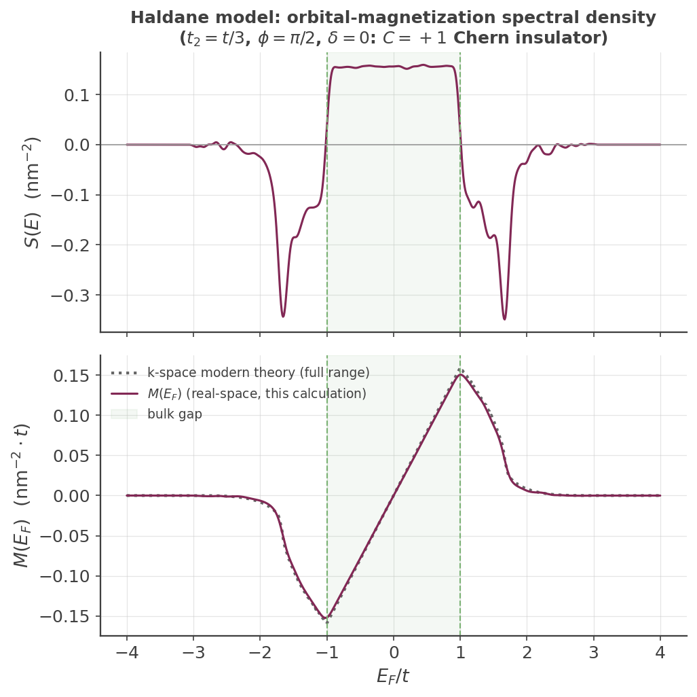

## Orbital magnetization: a real-space spectral approach with a rank-one vertex

The [custom-vertex spin Hall page][custom-vertex-example] shows KITE's **rank-two** machinery
([`#!python custom_two()`][calculation-custom_two]), which evaluates a *two-operator* Kubo-Bastin correlator
$\mathrm{Tr}[T_m(\hat H)\,B\,T_n(\hat H)\,A]$. This page uses the complementary **rank-one** method,
[`#!python custom_one()`][calculation-custom_one], to compute a genuinely different kind of quantity: an
**energy-resolved spectral function of a single operator**, which upon integration up to the Fermi level yields
a ground-state expectation value. The operator here is the **orbital magnetic moment**, and the example
reproduces, at laptop scale, the real-space spectral approach to orbital magnetization of Vidarte *et al.*[^1]

### What orbital magnetization is, and why it is subtle

The orbital magnetization $\mathbf M$ is the magnetic moment per unit volume arising from the *orbital* (as
opposed to spin) motion of the electrons. Classically a magnetic moment is
$\mathbf m=\tfrac12\,\mathbf r\times(-e)\dot{\mathbf r}$, so the natural quantum operator for its $z$-component
is built from the position $\hat{\mathbf r}$ and the velocity $\hat{\mathbf v}=\dot{\hat{\mathbf r}}$. The
subtlety that makes orbital magnetization a decades-long theoretical problem is that $\hat{\mathbf r}$ is
**unbounded and ill-defined under periodic boundary conditions** — you cannot simply take a bulk Bloch-state
expectation value of $\hat r$. The modern theory of orbital magnetization resolves this in $\mathbf k$-space
(Xiao, Shi & Niu[^4]; Thonhauser, Ceresoli, Vanderbilt & Resta[^5]); the approach used here[^1] instead works
**directly in real space** with open boundaries, where $\hat r$ *is* well-defined, and expands the resulting
spectral function in Chebyshev polynomials — precisely what KITE's KPM engine is built for. The reference
defines

$$
\hat M_z \;=\; -\frac{ie}{2\hbar c\,\mathcal A}\,\big(\hat x\hat H\hat y-\hat y\hat H\hat x\big),
$$

with $e>0$ the elementary charge (the electron's own charge $-e$ is already the explicit minus sign) and
$\mathcal A$ the sample area — the commutator form quoted in the reference's abstract.

### Building the operator: the rank-one vertex, derived

`#!python examples/haldane_orbital_magnetization.py` defines the vertex as the **raw** commutator, with plain
real coefficients:

``` python
A = custom.Vertex(M, [[1.0, "rx.vy"],
                      [-1.0, "ry.vx"]])
```

Recall that operator strings apply **right-to-left**, so `#!python "rx.vy"` $=\hat r_x\hat v_y$ (with
$\hat v_y$ acting first). This vertex evaluates to exactly

$$
A \;=\; \hat x\hat H\hat y-\hat y\hat H\hat x,
$$

i.e. $A$ **is** the operator combination inside $\hat M_z$ above, with no extra coefficient — the whole
physical prefactor $-ie/(2\hbar c\mathcal A)$ is applied later, in post-processing (see below), not baked into
the vertex.

!!! Info "Why there's no `#!python i` in the vertex, and why that's correct"

    KITE's raw `#!python "vx"`/`#!python "vy"` DSL token is $[\hat H,\hat r]$ — missing the $i/\hbar$ factor of
    the textbook Hermitian velocity operator (a deliberate KITE convention, see
    [`#!bash KITE-tools --CustomOne`][kite-tools-customone]). $A$ above is built from **one** ("v" token per
    term, an odd count), so $\mathrm{Tr}[T_n(\hat H)A]$ comes out purely **imaginary**, not real — the genuine
    physical signal, not noise. `#!python custom_one()` auto-detects this parity directly from the vertex
    string (`#!python NumVelocities`) and `#!bash --CustomOne` uses it to reconstruct the correct (imaginary)
    component automatically — you do not need to insert a compensating `#!python i` yourself. (An earlier
    version of this example *did* insert one by hand; it wasn't wrong, but it's no longer necessary, and
    keeping the vertex in this raw form makes the operator-to-paper mapping direct and auditable.)

### How `custom_one` differs from `custom_two`

| | `#!python custom_one()` (this page) | `#!python custom_two()` ([spin Hall page][custom-vertex-example]) |
|---|---|---|
| operators | **one** vertex $A$ | **two** vertices $A$, $B$ |
| Chebyshev family | **single** | **double** (nested) |
| output | moment **vector** $\mu_n=\mathrm{Tr}[T_n(\hat H)\,A]$ | moment **matrix** $\Gamma_{mn}=\mathrm{Tr}[T_m(\hat H)\,B\,T_n(\hat H)\,A]$ |
| yields | an operator-weighted **spectral density** $\to$ ground-state expectation value | a **two-point response** (conductivity, spin Hall, …) |

Under the hood ([`#!python Src/Simulation/Custom/SimulationRankOne.cpp`][sim-rank-one]), `#!python custom_one()`
seeds a random vector $|r\rangle$, applies $A$ to it, then runs a single Chebyshev recursion generating
$T_n(\hat H)\,A|r\rangle$ and accumulates $\langle r|T_n(\hat H)\,A|r\rangle$ as the stochastic estimate of
$\mu_n=\mathrm{Tr}[T_n(\hat H)\,A]$.

### From moments to spectral density and magnetization

Unlike `#!python custom_two()`, `#!python custom_one()` **does** have a KITE-tools post-processing step:
[`#!bash KITE-tools --CustomOne`][kite-tools-customone] reconstructs the raw energy-resolved trace $S_{\rm
raw}(E)$ from the moments with the same Jackson-kernel machinery as `#!bash --DOS`, including the
$1/E_{\rm scale}$ Jacobian and the real/imaginary rotation this vertex's odd velocity count requires.

Two remaining, genuinely subtle normalization factors turn $S_{\rm raw}(E)$ into the actual physical density
$S(E)=\mathrm{Tr}[\hat M_z\,\delta(E-\hat H)]$ (both worked out from scratch in
`#!python process_haldane_orbital_magnetization.py`, not fit to match anything):

1. **Per-orbital → per-area.** KITE's stochastic trace is normalized per total degree of freedom (verified
   directly: `#!bash --DOS` integrates to exactly $1$ over the whole spectrum, not the number of orbitals per
   cell). Converting to a genuine per-unit-area density multiplies by
   $N_{\rm orbitals}/\mathcal A_{\rm cell}$ (read directly from the output file's `#!bash NOrbitals` and
   `#!bash LattVectors`) — the per-cell factors cancel between the extensive trace and the extensive sample
   area, leaving this fixed ratio.
2. **A hidden Jacobian from rescaled hoppings.** KITE's `#!python "vx"`/`#!python "vy"` are built directly from
   the hopping values *as exported to the HDF5* — which `#!python src/kite/__init__.py` already divides by
   `#!bash EnergyScale` before KITEx ever runs. So the vertex KITE actually evaluates is
   $A_{\rm computed}=A_{\rm physical}/E_{\rm scale}$, and reconstructing the physical density needs an extra,
   easy-to-miss factor of $E_{\rm scale}$ to compensate. (This doesn't show up in the `#!bash --DOS` integral
   check above — the identity operator has no hopping-dependent "v" tokens — only in a vertex actually built
   from one.)

With $e=\hbar=c=1$: $S(E) = 0.5\,E_{\rm scale}\,(N_{\rm orbitals}/\mathcal A_{\rm cell})\,S_{\rm raw}(E)$. Its
running integral $M(E_F)=\int_{-\infty}^{E_F}S(E)\,dE$ is the orbital magnetization up to Fermi level $E_F$.

### The Haldane model and why this phase is topological

The example uses the Haldane model[^3] — a **single-spin** Chern insulator — not the spin-doubled Kane-Mele
construction of the [spin Hall page][custom-vertex-example]. On the honeycomb lattice with two sublattices A/B,
nearest-neighbour hopping is $-t$ and the next-nearest-neighbour hopping carries a complex Haldane phase, $+\phi$
on the A–A bonds and $-\phi$ on the B–B bonds, with $t_2=t/3$, $\phi=\pi/2$, $\delta=0$ (no Semenoff mass).

**The bulk gap is $|E|<1$, not $\sqrt3$.** The local Dirac-point mass is $3\sqrt3\,t_2\sin\phi=\sqrt3\approx1.73$,
but the lattice model's actual (smaller) *indirect* band gap — verified numerically to 10 significant figures
via [`#!python kite.visualize.hamiltonian_k`][kite-visualize] and independently via a
Fukui-Hatsugai-Suzuki lattice Chern-number calculation (converged, gap never closes from a $20\times20$ to
$120\times120$ k-mesh) — is exactly $|E|<1$. Both calculations agree the filled/valence band has **Chern
number $C=+1$** for this bond-phase assignment.

**Boundaries are OPEN, and this is mandatory:** the position operator entering the vertex is only well-defined
without periodic wrapping. A direct and physically important consequence is that the finite open sample hosts
**chiral edge states** that traverse the bulk gap and carry orbital magnetization — so, unlike the density of
states, the orbital-magnetization spectral density is generically **nonzero inside the bulk gap**.

**A small amount of Anderson disorder helps convergence.** `#!python haldane_orbital_magnetization.py` adds
weak uniform on-site disorder ($W=0.05$, well below the gap) on both sublattices and averages over several
disorder realizations — this converges the stochastic trace considerably faster than a fully clean, large
`#!python num_random_` run would on its own (matching the same lesson learned for the
[Kane-Mele disorder example][custom-vertex-example]).

### Verified result

At $L=64$, $M=512$ moments, $R=400$ random vectors, $4$ disorder realizations, the full `#!python KITEx` run
takes about a minute and a half on a laptop.

<figure>
    
    <figcaption>Top: energy-resolved orbital-magnetization spectral density S(E), in physical units. Bottom:
    its running integral M(E_F), tracking the exact k-space (Streda-relation) prediction closely across the
    bulk gap (shaded).</figcaption>
</figure>

The upper panel shows bulk-band weight for $|E|\gtrsim1$, sharp resonance dips right at the gap edges, and a
roughly constant in-gap density from the finite-system **edge states**. The lower panel is the physics to look
for: as $E_F$ is swept across the gap, $M(E_F)$ rises **linearly**, and a fit restricted to well inside the gap
($|E|<0.8$, away from the disorder-broadened gap edge) gives

$$
\left.\frac{dM}{dE_F}\right|_{\rm fit} = 0.154,
$$

compared to the **exact** topological (Streda-relation) prediction $C/(2\pi)=0.1592$ for $C=+1$ — agreement to
**~3%**, consistent with residual finite-`#!python num_random_`/disorder-realization stochastic noise, not a
systematic error. (A fit window extending too close to the gap edge biases the slope badly — e.g. $|E|<1.5$
gives only $0.113$ — because it starts incorporating band-edge states; the gap is only $|E|<1$, so keep the
fit window safely inside it.)

This was the resolution of a genuine sign puzzle encountered while building this example: an earlier,
independent k-space cross-check appeared to disagree with the real-space result *in sign*. That disagreement
traced back to a bug in a separate, throwaway Chern-number script used only for that cross-check (a
plaquette-loop-orientation/band-index mix-up) — not to anything in this vertex, in
`#!python kite.visualize.hamiltonian_k`, or in the real-space reconstruction above, both of which were
independently re-verified and found correct.

!!! example

    Get more familiar with KITE: run [`#!python examples/haldane_orbital_magnetization.py`][haldane-om-example]
    and its post-processing yourself, and try tuning $\phi$ away from $\pi/2$ or turning on a Semenoff mass
    $\delta$ toward the transition at $\delta=\sqrt3$ — the in-gap slope of $M(E_F)$ should collapse as the
    phase becomes trivial.

[^1]: K. J. U. Vidarte, H. P. Veiga, J. M. Viana Parente Lopes, R. Cardias, A. Ferreira, T. P. Cysne, and T. G. Rappoport, "Real-Space Spectral Approach to Orbital Magnetization," [Phys. Rev. B, doi:10.1103/bhg8-c3rw](https://journals.aps.org/prb/abstract/10.1103/bhg8-c3rw) ([arXiv:2512.01575](https://arxiv.org/abs/2512.01575)).
[^3]: F. D. M. Haldane, [Phys. Rev. Lett. **61**, 2015 (1988)](https://doi.org/10.1103/PhysRevLett.61.2015).
[^4]: D. Xiao, J. Shi, and Q. Niu, [Phys. Rev. Lett. **95**, 137204 (2005)](https://doi.org/10.1103/PhysRevLett.95.137204).
[^5]: T. Thonhauser, D. Ceresoli, D. Vanderbilt, and R. Resta, [Phys. Rev. Lett. **95**, 137205 (2005)](https://doi.org/10.1103/PhysRevLett.95.137205).

[calculation-custom_one]: ../../api/kite.md#calculation-custom_one
[calculation-custom_two]: ../../api/kite.md#calculation-custom_two
[custom-vertex-example]: custom_vertex_operators.md
[haldane-om-example]: https://github.com/quantum-kite/kite-v2/tree/master/examples/haldane_orbital_magnetization.py
[sim-rank-one]: https://github.com/quantum-kite/kite-v2/tree/master/Src/Simulation/Custom/SimulationRankOne.cpp
[kite-tools-customone]: ../../api/kite-tools.md#kite-tools-customone
[kite-visualize]: ../../api/kite.md#kitevisualize
