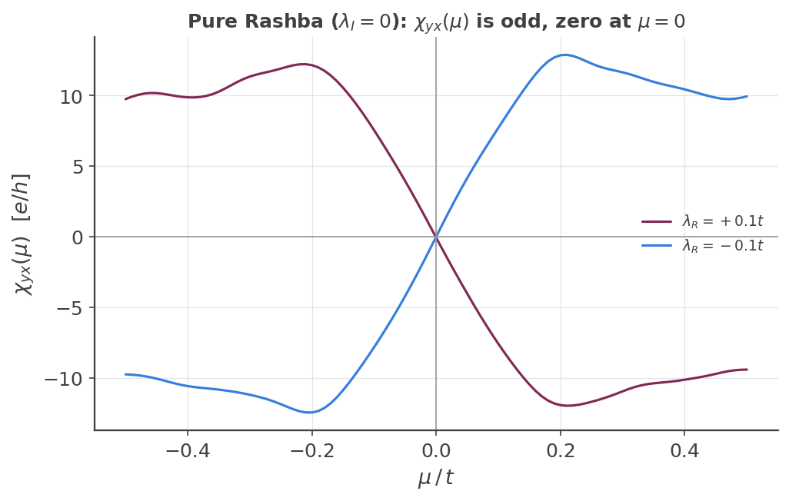

## Rashba-Edelstein effect: spin density from a bare-density vertex

The [custom-vertex spin Hall page][custom-vertex-example] builds the **spin current** vertex
$\tfrac12\{\hat v_x,\hat s_z\}$. This page uses the same `#!python custom_two()` Kubo-Bastin
machinery with a **different** vertex — the bare spin density $\hat s_x$, with no velocity
symmetrization — to compute the Rashba-Edelstein effect (REE): the spin-density response
$\chi_{yx}=\partial\langle\hat s_x\rangle/\partial E_y$ to an in-plane electric field, present
only when inversion symmetry is broken. (For how the raw $\Gamma_{mn}$ moment matrix is turned
into this response, see the [general Kubo-Bastin reconstruction rule][custom-vertex-example] and
[`#!bash KITE-tools --CustomTwo`][kite-tools-customtwo].)

### The two spin-orbit terms, and why only one gives REE

The lattice is the same spin-doubled honeycomb model as
[the spin Hall page][custom-vertex-example] (`Aup, Bup, Adn, Bdn`), with **two** spin-orbit
terms that can be switched on independently:

- **Kane-Mele intrinsic SOC** ($\lambda_I$, next-nearest-neighbor, spin-diagonal, opposite phase
  per spin) — **inversion-symmetric**. It opens a gap and drives the quantized spin Hall
  response, but by itself must contribute **zero** to any spin-density response to a field: it
  cannot distinguish "spin up here" from "spin up there," so it cannot polarize.
- **Rashba SOC** ($\lambda_R$, nearest-neighbor, **spin-flip**, direction-dependent) —
  **inversion-breaking**. This is the actual source of REE.

$$
\hat H_R = i\lambda_R\sum_{\langle ij\rangle}\hat c_i^\dagger\,(\boldsymbol\sigma\times\hat
d_{ij})_z\,\hat c_j
$$

### The vertex

`#!python examples/rashba_edelstein_graphene.py` defines:

``` python
A = custom.Vertex(moments, [[1.0, "l0"]])   # bare s_x, no velocity symmetrization
B = custom.Vertex(moments, [[1.0, "vy"]])   # charge velocity
```

$\hat s_x=\tfrac12\sigma_x$ is **off-diagonal** in the up/down sublattice basis (unlike $\hat
s_z$, which is diagonal on the spin Hall page) — registered as

``` python
calculation.add_orbital_coupling('Adn', 'Aup', 0.5, 'l0')
calculation.add_orbital_coupling('Aup', 'Adn', 0.5, 'l0')
calculation.add_orbital_coupling('Bdn', 'Bup', 0.5, 'l0')
calculation.add_orbital_coupling('Bup', 'Bdn', 0.5, 'l0')
```

!!! Info "Custom-operator labels are positional, not arbitrary names"

    The trailing digit in a label like `#!python "l0"` is read back by KITEx with `#!cpp
    std::stoi` and used directly as a **0-indexed lookup** into the vector of registered operator
    matrices (`#!cpp act_with_stream`, `#!bash Src/Simulation/Custom/SimulationRankOne.cpp`).
    Since only **one** custom operator is registered in this example, it must be called
    `#!python "l0"` — calling it `#!python "l1"` (as if it were an independently-chosen name)
    segfaults, an out-of-bounds vector access, not merely a cosmetic misnaming.

### The Rashba hopping term: adapted, not re-derived

Rather than re-deriving the honeycomb Rashba bond phases from scratch, this reuses the exact
numerical convention already validated and shipped elsewhere in this codebase —
`#!bash examples/paper/Section_4_B_topology/Input/qahe_disorder.py` and
`#!bash examples/paper/Section_4_E_spintronics/Input/gaussian_wavepacket_only_anderson.py` both
use $\rho=\lambda_R\cdot2i/3$ as the Rashba magnitude, with per-bond coefficients that are a pure
phase times $\rho$, determined by the bond's unit direction $\hat d=(d_x,d_y)$:

$$
t(\hat A_\uparrow\!\to\!\hat B_\downarrow,\,\hat d) = \rho\,(d_y+i d_x), \qquad
t(\hat A_\downarrow\!\to\!\hat B_\uparrow,\,\hat d) = \rho\,(d_y-i d_x)
$$

— cross-checked to reproduce **every one** of both reference files' hard-coded coefficients
exactly, despite the two files using different unit-cell orientations from each other and from
`#!python kane_mele_spin_hall.py`. The formula above (not either file's literal numbers) is what's
reused, applied to `#!python kane_mele_spin_hall.py`'s own, already-verified bond geometry: the
three NN bonds (`relative_index` `[0,0]`, `[1,-1]`, `[0,-1]`) point at $90°,-30°,-150°$.

### Default parameters: pure Rashba, no Kane-Mele

`#!python examples/rashba_edelstein_graphene.py`'s `#!python main()` defaults to
$\lambda_I=0$ (`#!python t2=0`) — Kane-Mele SOC is switched off. This isn't just a simpler
starting point: with $\lambda_I=0$ the model is particle-hole symmetric, so $\chi_{yx}(\mu)$ must
be an **odd function of $\mu$** with a genuine zero at $\mu=0$ — a much sharper, cleaner
structural target than anything involving the Kane-Mele gap. Turning $\lambda_I$ on reintroduces a
bulk gap and van Hove singularities in the band structure (confirmed directly: `#!python
kite.visualize.plot_bands`/`#!python compute_bands` on this lattice show a sharp DOS peak exactly
where $\chi_{yx}$'s largest feature sits), which is real physics but makes the basic sign/symmetry
check harder to read at a glance.

The lattice is $128\times128$ unit cells (`#!python nx=ny=2` domain decomposition), with a small
amount of Anderson disorder (`#!python disorder_w=0.05`, uniform, all four sublattices,
`#!python num_disorder_=4` realizations) — this smooths out the sample-to-sample oscillations
visible in a fully clean, small-`#!python num_random_` reconstruction, the same lesson already
learned for `#!python haldane_orbital_magnetization.py` and
`#!python kane_mele_spin_hall.py`. `#!python num_random_=50` and `#!python moments=256`
are unchanged.

### Validation

Three structural checks, cheap and independent of any absolute-normalization ambiguity:

1. $\lambda_R\neq0$: REE response should be nonzero.
2. $\lambda_I=0$ (particle-hole symmetric): $\chi_{yx}(\mu)$ must be **odd in $\mu$**, with a
   genuine zero at $\mu=0$.
3. Flipping the sign of $\lambda_R$ must flip the sign of $\chi_{yx}$ at every $\mu$: the Rashba
   term's helicity reverses, so the induced spin density $\mathbf S_\text{REE}\propto\hat
   z\times\mathbf E$ reverses too — the same sign-inversion signature shown in Fig. 2(a) of
   Medina Dueñas *et al.*[^1]

<figure>
    
    <figcaption>chi_yx(mu) near mu=0, lambda_R=+0.1t and lambda_R=-0.1t: an exact odd function,
    crossing zero at mu=0, the two curves exact mirror images of each other.</figcaption>
</figure>

<figure>
    
    <figcaption>chi_yx(mu) over the full bandwidth: the same odd symmetry holds everywhere, with a
    Kane-Mele-only control (lambda_R=0) staying near zero throughout.</figcaption>
</figure>

Both structural checks (2) and (3) are visibly satisfied in the first figure — the two curves are
exact mirror images through the origin. The second figure extends this over the full bandwidth and
adds check (1)'s control.

!!! example

    Get more familiar with KITE: run [`#!python examples/rashba_edelstein_graphene.py`][ree-example]
    and its post-processing yourself, and try turning Kane-Mele SOC back on (`#!python t2!=0`) to
    see the bulk gap and van Hove features reappear in $\chi_{yx}(\mu)$.

[^1]: J. Medina Dueñas, S. Giménez de Castro, J. H. García, and S. Roche, "Optimal spin-charge interconversion in graphene through spin-pseudospin entanglement control," [Commun. Phys. (2026)](https://www.nature.com/articles/s42005-026-02658-9) ([arXiv:2510.21240](https://arxiv.org/abs/2510.21240)).

[custom-vertex-example]: custom_vertex_operators.md
[ree-example]: https://github.com/quantum-kite/kite-v2/tree/master/examples/rashba_edelstein_graphene.py
[kite-tools-customtwo]: ../../api/kite-tools.md#kite-tools-customtwo
