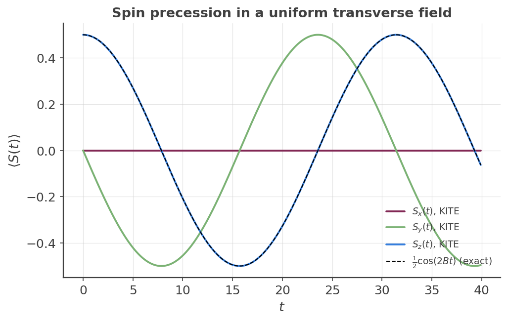

## Real-time evolution of a wave packet

Every other calculation on this site is a *static* linear-response quantity: a density of
states, a conductivity, a spectral function — all computed once and for all from the
Hamiltonian's spectrum. [`#!python calculation.gaussian_wave_packet()`][calculation-gaussian_wave_packet]
is different: it builds a Gaussian-enveloped wave packet and propagates it **in real time**,
using a Chebyshev expansion of $e^{-iHt}$, then reports the expectation value of whatever
operators you ask for at every timestep. This page is a from-scratch introduction to that
feature, using the simplest possible physical system it can demonstrate.

### The physics: spin precession in a field

A spin-$\tfrac12$ placed in a uniform transverse field $B$ (a textbook Larmor-precession
problem) has Hamiltonian $\hat H = B\hat\sigma_x$. Starting from the $S_z=+\tfrac12$
eigenstate, the exact solution is

$$
\langle S_z(t)\rangle = \tfrac12\cos(2Bt), \qquad
\langle S_y(t)\rangle = -\tfrac12\sin(2Bt), \qquad
\langle S_x(t)\rangle = 0 \ \ \forall t.
$$

`#!python examples/spin_precession_simple.py` realizes exactly this on an ordinary square
lattice: two orbitals ("up","down") at every site, identical plain nearest-neighbor hopping
$-t$ for both (the kinetic part carries no spin information at all), and a single on-site
term coupling them,

``` python
lat.add_hoppings(
    ([1, 0], 'up', 'up', -t),
    ([0, 1], 'up', 'up', -t),
    ([1, 0], 'down', 'down', -t),
    ([0, 1], 'down', 'down', -t),
    ([0, 0], 'up', 'down', B),   # on-site transverse field, B*sigma_x
)
```

!!! Info "This is a toy model, not a simulated magnetic field"

    $B$ is a bare on-site coupling constant with the mathematical structure of a transverse
    Zeeman term — there is no vector potential, no Peierls substitution, no g-factor, and no
    coupling to a real electromagnetic field anywhere in this construction. The hopping $-t$ is
    likewise pure numerical scaffolding: KITE's real-space method needs an extended periodic
    lattice, so it can't simulate a literal isolated two-level system, but $t$ carries no
    physics of its own here (identical for both orbitals, it drops out of the spin dynamics
    entirely — see below). The only thing this model is meant to demonstrate is the propagator
    and the operator-tracking mechanism, on the simplest Hamiltonian that shows real precession.

Only the single `#!python ([0, 0], 'up', 'down', B)` line needs to be given — KITE completes it
into the full Hermitian $2\times2$ matrix automatically. Whenever a hopping is registered at
`#!python relative_index=[0, 0]` between two different sublattices, the lattice-export step adds
the reverse-direction term with the conjugate-transposed value for you (the same is true, at
`#!python -relative_index`, for any nonzero bond); see `#!python config_system()`'s internals if
you want to check this yourself. Every other example on this site relies on the same
auto-completion — only one direction of each bond is ever written out explicitly.

Because the field term doesn't depend on $k$ and the kinetic part is identical for both
orbitals, the full Bloch Hamiltonian factorizes exactly as $H(k)=\varepsilon(k)\hat I+B\hat\sigma_x$
at *every* $k$ — so the precession above holds exactly, for a wave packet of any width or
shape, with **no dephasing**. (Contrast this with the
[orbital angular momentum/quadrupole example][oam-example], where the analogous coupling
term is $k$-dependent, and a finite-width wave packet dephases from its own momentum spread —
a genuinely different, more advanced regime.)

### Tracking an operator during propagation

`#!python gaussian_wave_packet()` has no built-in notion of spin or any other operator: whatever
you want to track is registered the same way as [`#!python custom_one()`][calculation-custom_one]'s
vertex operators, via [`#!python add_orbital_coupling()`][calculation-add_orbital_coupling], then
passed in as `#!python operators=[...]`:

``` python
calculation.add_orbital_index('up', 0)
calculation.add_orbital_index('down', 1)

calculation.add_orbital_coupling('down', 'up', 0.5, 'l0')   # S_x
calculation.add_orbital_coupling('up', 'down', 0.5, 'l0')
calculation.add_orbital_coupling('down', 'up', -0.5j, 'l1')  # S_y
calculation.add_orbital_coupling('up', 'down', 0.5j, 'l1')
calculation.add_orbital_coupling('up', 'up', 0.5, 'l2')      # S_z
calculation.add_orbital_coupling('down', 'down', -0.5, 'l2')

calculation.gaussian_wave_packet(
    num_points=400, num_moments=256, num_disorder=1,
    k_vector=[[0.0, 0.0]], spinor=[[1.0, 0.0]], width=4.0, timestep=0.5,
    mean_value=[64, 64], operators=['l0', 'l1', 'l2'])
```

The `#!python spinor=[[1.0, 0.0]]` seeds the wave packet purely in the "up" orbital — the
$S_z=+\tfrac12$ eigenstate. As with `#!python custom_one()`/`#!python custom_two()`, this
mechanism has one hard restriction worth knowing up front: a tracked operator must be a single
on-site matrix, identical at every site — it cannot represent a quantity that couples different
lattice sites (see the warning under
[`#!python add_orbital_coupling()`][calculation-add_orbital_coupling]).

### Validation

<figure>
    
    <figcaption>KITE's Sx, Sy, Sz (solid) exactly overlay the analytic prediction (dashed). Sx
    stays at zero throughout; Sy, Sz precess a full period with no visible damping, matching a
    machine-precision (~1e-13) comparison against the exact solution.</figcaption>
</figure>

KITE's output matches the exact analytic solution to machine precision ($\max|\Delta S_z|\approx
6\times10^{-14}$) over more than one full precession period — a strong, cheap correctness check
for both the propagator and the operator-registration mechanism.

!!! example

    Get more familiar with KITE: run [`#!python examples/spin_precession_simple.py`][precession-example]
    and its post-processing yourself, and try changing $B$ (the precession frequency scales as
    $2B$) or seeding a different initial spinor (e.g. an $S_x$ eigenstate) to see a different
    precession plane.

[calculation-gaussian_wave_packet]: ../../api/kite.md#calculation-gaussian_wave_packet
[calculation-custom_one]: ../../api/kite.md#calculation-custom_one
[calculation-add_orbital_coupling]: ../../api/kite.md#calculation-add_orbital_coupling
[oam-example]: oam_quadrupole_precession.md
[precession-example]: https://github.com/quantum-kite/kite-v2/tree/master/examples/spin_precession_simple.py
