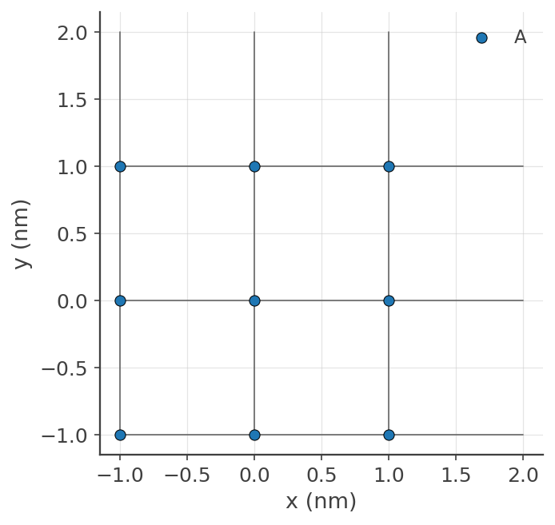
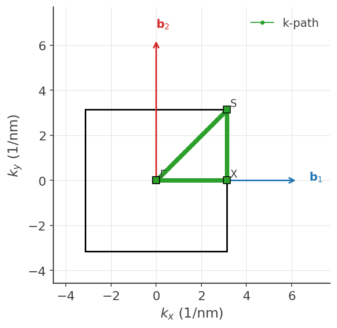
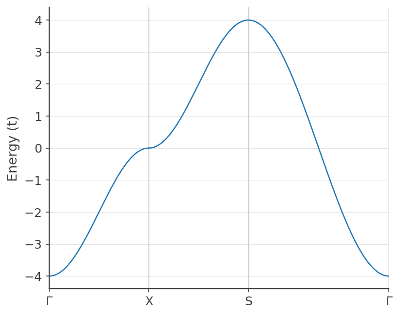

The aim of the current section is to help us gain familiarity with the lattice model of KITE.
Thus, we begin by constructing a periodic [`#!python kite.lattice.Lattice`][lattice] using KITE's own,
native (pybinding-free) lattice tools, visualizing it, and computing its band structure directly from the
lattice's own hoppings with [`#!python kite.visualize`][kitevisualize].
In the following sections, we will learn how to use [KITEx][kitex] to significantly scale up the simulations and introduce modifications to the lattice model.

For efficiency, the default options of KITE's core code ([KITEx][kitex]) assume that the lattice model has a certain degree of interconnectivity or hopping range. 
Specifically, the default is that the tight-binding Hamiltonian has non-zero matrix elements between orbitals that belong to unit cells 
that are separated by at most 2 lattice spacings along a given direction (for example, in a simple single-orbital 1D chain this would allow defining models
with up to second-nearest neighbors). To relax this constraint and thus be able to simulate more complex lattice models, users must adjust the NGHOSTS parameter in `#!bash kite/Src/Generic.hpp` and recompile [KITEx][kitex], otherwise an error message is output and the KITE program exits.

!!! Info

    `NGHOSTS` is the depth of the "ghost" halo KITEx adds around each thread's sub-domain in its
    [domain decomposition][code_structure] — it has to be at least as deep as the longest-range hopping
    in your model, which is why the default of 2 caps interconnectivity at 2 lattice spacings. See
    [Code Structure & Compilation Options][code_structure] for how this connects to domain decomposition,
    `TILE`, and memory usage.

!!! Note

    `#!python kite.lattice.Lattice`'s construction syntax (`#!python add_sublattices`/`#!python
    add_hoppings`) deliberately mirrors [Pybinding]'s `#!python pb.Lattice` API, which KITE used
    exclusively in earlier versions — if you're already familiar with Pybinding lattices, everything
    below will look immediately familiar, just imported from `#!python kite` instead. Pybinding itself is
    still supported as an optional extra (`#!bash pip install -e ".[pybinding]"`) for the handful of
    examples that need its own model-building workflow (see `#!bash examples/pybinding/README.md`), but it
    is no longer required to define, visualize, or diagonalize a lattice.

!!! Note

    The python script that generates KITE's input file requires a few packages that can be included with the following aliases
    
    ``` python
    import kite
    from kite import lattice as latt
    from kite import visualize as viz
    import numpy as np
    import matplotlib.pyplot as plt
    ```

## Constructing a `#!python kite.lattice.Lattice`
The [`#!python kite.lattice.Lattice`][lattice] class carries the information about the [TB model][tightbinding].
This includes:

* [Crystal structure (*lattice unit cell* and *basis*)][unitcell]
* [Onsite energies][onsite]
* [Hopping parameters][hopping]

It also provides additional functionality based on the above *real-space* information: the *reciprocal
vectors* (`#!python lattice.reciprocal_vectors()`) and the *Brillouin zone* (`#!python
lattice.brillouin_zone()`, 1D/2D lattices for now).

### Defining the unit cell
As a simple example, let us construct a square lattice with a single orbital per unit cell.
The following syntax can be used to define the primitive lattice vectors:

``` python linenums="1"
a1 = np.array([1, 0]) # [a] defines the first lattice vector
a2 = np.array([0, 1]) # [a] defines the second lattice vector

lat = latt.Lattice(a1=a1, a2=a2) # defines a lattice object
```

### Adding lattice sites
We can then add the desired lattice sites/orbitals inside the unit cell (the same syntax can be used to add different orbitals in a given position or more sites in different sublattices):

``` python linenums="1"
onsite = 0 # onsite potential
lat.add_sublattices(
    # generates a lattice site (sublattice) with a tuple
    # (name, position, and onsite potential)
    ('A', [0, 0], onsite)
)
```

### Adding hoppings
By default, the main unit cell has the index `#!python [n1,n2] = [0, 0]`.
The hoppings between neighboring sites can be added with the simple syntax:

``` python linenums="1"
t = 1.0
lat.add_hoppings(
    # generated a hopping between lattice sites with a tuple
    # (relative unit cell index, site from, site to, hopping energy)
    ([1, 0], 'A', 'A', -t),
    ([0, 1], 'A', 'A', -t)
)
```

Here, the relative indices `#!python n1,n2` represent the number of integer steps - in units of the primitive lattice vectors - needed to reach a neighboring cell starting from the origin.

If the lattice has more than one sublattice, the hoppings can connect sites in the same unit cell.

!!! note

    When adding the hopping `#!python (n, m)` between sites `#!python n` and `#!python m`,
    the conjugate hopping term `#!python (m, n)` is **not** added automatically —
    `#!python add_one_hopping`'s own docstring says so explicitly. This is the opposite of Pybinding's
    behavior (which adds it for you and refuses a manual duplicate). It doesn't matter for the actual
    physics KITE computes — [KITEx][kitex] always builds the full Hermitian Hamiltonian from whichever
    single direction you store — but it does matter if you build `#!python H(k)` directly yourself:
    [`#!python kite.visualize.hamiltonian_k`][visualize-hamiltonian_k] (used below) accounts for this by
    construction, adding the missing reverse-direction term for you automatically.

### Visualization
Now we can plot the [`#!python kite.lattice.Lattice`][lattice] and visualize the Brillouin zone, using
[`#!python kite.visualize`][kitevisualize] (pure matplotlib/numpy — no KITEx/KITE-tools involved at any
point in this section):

``` python linenums="1"
viz.plot_unit_cell(lat)
plt.show()

viz.plot_brillouin_zone(lat)
plt.show()
```

<div>
  <figure>
    
    
    <figcaption>The visualization of the lattice and its Brillouin zone (with a k-path already overlaid — see below).</figcaption>
  </figure>
</div>

!!! Example "Examples"

    For a crystal with two atoms per unit cell, look in the [Examples] section.


## Band structure straight from the lattice

Unlike a Pybinding-based workflow, there is no separate "Model"/"Solver" step needed here:
[`#!python kite.visualize.compute_bands`][visualize-compute_bands] diagonalizes the Bloch Hamiltonian
built directly from the *primitive* lattice's own hoppings (via
[`#!python hamiltonian_k`][visualize-hamiltonian_k]) at each point of a k-path — no supercell replication
or translational-symmetry setup required, since a Bloch Hamiltonian is already periodic by construction.
This is a fast (pure numpy), KITEx-independent way to sanity-check a lattice definition — right gap, right
symmetry, right degeneracy — before spending compute on an actual KPM run.

### Building a k-path
First, for a two-dimensional plot, we define a path in the reciprocal space that connects the high
symmetry points. Using [`#!python lattice.brillouin_zone()`][lattice], the high-symmetry points for the
corners of a path can be found easily, exactly as before:

``` python linenums="1"
bz = lat.brillouin_zone()
gamma = np.array([0, 0])
x = (bz[1] + bz[2]) / 2
s = bz[2]
```

[`#!python kite.visualize.make_path`][visualize-make_path] then builds the actual sampled path, with point
density set by real Cartesian reciprocal-space distance (not a fixed count per segment):

``` python linenums="1"
path = viz.make_path(gamma, x, s, gamma, step=0.02,
                      point_labels=[r"$\Gamma$", "X", "S", r"$\Gamma$"])
```

### Band structure calculation
We can now compute and plot the bands directly, and overlay the same path on the Brillouin zone:

``` python linenums="1"
viz.plot_bands(lat, path, ylabel="Energy (t)")
plt.show()

viz.plot_brillouin_zone(lat, k_path=path)
plt.show()
```

<div>
  <figure>
    
    
    <figcaption>The visualization of the band structure and its path in the reciprocal space.</figcaption>
  </figure>
</div>

For this simple square lattice, $E(\mathbf k)=-2t(\cos k_x+\cos k_y)$, so $E(\Gamma)=-4t$, $E(X)=0$,
$E(S)=+4t$ — exactly what `#!python examples/lattice_visualization_demo.py` (the runnable script behind
this page, verified when this page was written) prints directly.

!!! Example "Summary of the code from this section"

    ``` python linenums="1"
    import kite
    from kite import lattice as latt
    from kite import visualize as viz
    import numpy as np
    import matplotlib.pyplot as plt

    a1 = np.array([1, 0]) # [a] define the first lattice vector
    a2 = np.array([0, 1]) # [a] define the second lattice vector

    lat = latt.Lattice(a1=a1, a2=a2) # define a lattice object


    onsite = 0 # onsite potential
    lat.add_sublattices(
        # make a lattice site (sublattice) with a tuple
        # (name, position, and onsite potential)
        ('A', [0, 0], onsite)
    )

    t = 1.0
    lat.add_hoppings(
        # make a hopping between lattice sites with a tuple
        # (relative unit cell index, site from, site to, hopping energy)
        ([1, 0], 'A', 'A', -t),
        ([0, 1], 'A', 'A', -t)
    )

    viz.plot_unit_cell(lat)
    plt.show()

    bz = lat.brillouin_zone()
    gamma = np.array([0, 0])
    x = (bz[1] + bz[2]) / 2
    s = bz[2]

    path = viz.make_path(gamma, x, s, gamma, step=0.02,
                          point_labels=[r"$\Gamma$", "X", "S", r"$\Gamma$"])

    viz.plot_bands(lat, path, ylabel="Energy (t)")
    plt.show()

    viz.plot_brillouin_zone(lat, k_path=path)
    plt.show()
    ```

[unitcell]: #defining-the-unit-cell
[onsite]: #adding-lattice-sites
[hopping]: #adding-hoppings
[hdf5]: https://www.hdfgroup.org
[Pybinding]: https://docs.pybinding.site/en/stable

[tightbinding]: ../background/tight_binding.md
[Examples]: examples/graphene.md

[kitepython]: ../api/kite.md
[kitex]: ../api/kitex.md
[kitevisualize]: ../api/kite.md#kitevisualize
[lattice]: ../api/kite.md#kitevisualize
[visualize-make_path]: ../api/kite.md#visualize-make_path
[visualize-hamiltonian_k]: ../api/kite.md#visualize-hamiltonian_k
[visualize-compute_bands]: ../api/kite.md#visualize-compute_bands
[code_structure]: code_structure.md#spatial-memory-domain-decomposition-and-ghost-regions
